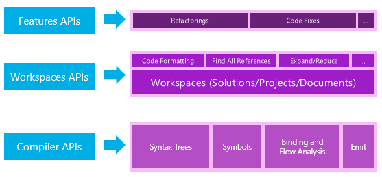
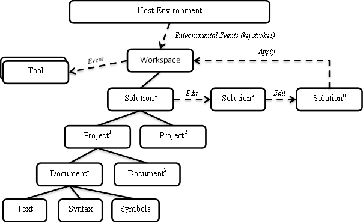

# .NET Compiler Platform ("Roslyn") 概要

原文：[.NET Compiler Platform ("Roslyn") Overview](http://roslyn.codeplex.com/wikipage?title=Overview)

(ダウンロード: [roslyn-overview.pdf](http://www.codeplex.com/Download?ProjectName=roslyn&DownloadId=822125))

## コンテンツ

* [イントロダクション](#introduction)
* [公開されているコンパイラーのAPI](#exposing_the_compiler_apis)
  * [コンパイラーパイプラインの機能領域](#compiler_pipeline_functional_areas)
  * [APIレイヤー](#api_layers)
    * [コンパイラーAPI](#compiler_apis)
    * [ワークスペースAPI](#workspaces_apis)
* [シンタックスに対する処理](#working_with_syntax)
  * [シンタックスツリー](#syntax_trees)
  * [シンタックスノード](#syntax_nodes)
  * [シンタックストークン](#syntax_tokens)
  * [シンタックストリヴィア](#syntax_trivia)
  * [スパン](#spans)
  * [カインド](#kinds)
  * [エラー](#errors)
* [セマンティクスに対する処理](#working_with_semantics)
  * [コンパイル要素](#compilation)
  * [シンボル](#symbols)
  * [セマンティックモデル](#semantic_model)
* [ワークスペースに対する処理](#working_with_a_workspace)
  * [ワークスペース](#workspace)
  * [ソリューション、プロジェクト、ドキュメント](#solutions_projects_documents)
* [まとめ](#summary)

## イントロダクション

コンパイラーは伝統的にブラックボックスなものです。
つまり一方からソースコードを入力して、中で何か魔法が起こり、
他方からオブジェクトファイルやアセンブリが出てくるといった具合です。
コンパイラーがこの魔法を行うためには、処理対象のソースコードに対する知識を
非常に詳しく積む必要があるわけですが、
コンパイラーを実装するウィザード以外がこの知識を得ることはできません。
また、翻訳済みの出力結果が生成されると、この知識は即座に忘れ去られてしまいます。

何年もの間、この作法はそういうものだと納得されてきたのですが、
しかし今はそういうわけにもいかなくなっています。
今や私たちは生産性を向上するために、
統合開発環境(IDE: integrated development environment)のIntelliSenseや
リファクタリング、高機能な名前変更、「すべての参照の検索」、「定義に移動」
といった機能を頼りにしています。
あるいはコードの品質を向上するためにコード分析ツールを使用したり、
アプリケーションを構築するためにコード生成機能を使用したりするようになっています。
これらのツールがより賢くなるにつれて、コンパイラしか知り得ないような
コードの深い知識がツール側でも必要になってきているわけです。
ここに.NET Compiler Platform ("Roslyn")のコアミッションがあります。
ブラックボックスの蓋を開けて、コンパイラーの持つコードに関する知識を
ツールやエンドユーザーが共有できるようにするというのがこのプロジェクトの目的です。
入力されるソースコードをオブジェクトコードとして出力するトランスレーターを
不透明にせず、.NET Compiler Platform ("Roslyn")を通すことによって
コンパイラーをプラットフォーム、つまり独自のツールやアプリケーションにおいて
コードに関するタスクを処理する際に使用できるようなAPIを提供できるようにする
というわけです。

コンパイラーをプラットフォームへと変換することにより、
コードを対象にするようなツールあるいはアプリケーションを作成するための
障壁を劇的に下げることができます。
それにより、たとえばメタプログラミングやコード生成、コード変更、
C#やVBといった言語をインタラクティブに使用したり、
C#やVBをドメイン固有言語として組み込んだりといった、
様々な領域においてイノベーションが見込めます。

また、.NET Compiler Platform ("Roslyn") SDK Previewには
コード生成や分析、リファクタリングにおける新しい言語オブジェクトモデルの
ドラフトが含まれています。
将来のプレビューでは、C#やVisual Basicをスクリプトあるいはインタラクティブに
使用できるようにするためのAPIドラフトも組み込むことが出来ればと考えています。
このドキュメントは.NET Compiler Platform ("Roslyn")の
概要を紹介するものです。
各機能の詳細についてはSDK Previewに含まれるウォークスルーやサンプルを
参照してください。

## 公開されているコンパイラーのAPI

### コンパイラーパイプラインの機能領域

.NET Compiler Platform ("Roslyn")はC#およびVisual Basicの
コンパイラーのコード解析機能を公開しています。
公開されているAPIはいずれも伝統的なコンパイラーパイプライン(compiler pipeline)
を反映したものになっています。

このパイプラインの各フェーズはそれぞれのコンポーネントに分けられています。
最初の解析フェーズではソースがトークンに分割されて、
言語の文法に応じてそれぞれのトークンがシンタックスとして解析されます。
次の宣言フェーズではソース上の宣言やインポートされたメタデータが分析されて、
名前付きのシンボルの形になります。
次のバインドフェーズではコード内の識別子とシンボルのマッチングが行われます。
最後のエミットフェーズではコンパイラによって構築された
すべての情報を元にしてアセンブリが生成されます。

それぞれのフェーズに応じて、各フェーズの情報にアクセスできるような
オブジェクトモデルが用意されています。
解析フェーズでは構文木、宣言フェーズでは階層的シンボルテーブル、
バインディングフェーズではコンパイラーの構文解析結果を反映するようなモデル、
エミットフェーズではILバイトコードを生成するAPIがそれぞれ用意されます。

それぞれのコンパイラーはこれらのコンポーネントを
1つの全体的なコンポーネントとして組み合わせています。

公開されているコンパイラーAPIが世界で通用するようなIDEの
機能を組み立てるに十分であることの裏付けとして、
Visual Studio vNextのC#とVBはこれらの言語サービスを使用するように
再構成されているということを補足しておきます。
具体的にはコードアウトラインやフォーマットの機能はシンタックスツリー、
オブジェクトブラウザーやナビゲージョンの機能はシンボルテーブル、
リファクタリングや定義へ移動の機能はセマンティックモデル、
エディットアンドコンティニューはエミットAPIも含めてすべての機能を利用しています。
これらの機能はVisual Studio 2013に"Roslyn" End-User Previewをインストールすることで
プレビューすることができます。
このPreviewは.NET Compiler Platform ("Roslyn") SDKを利用する
アプリケーションをビルドおよびテストするためにも必要です。
つまりVisual Studioに統合された.NET Compiler Platform ("Roslyn") APIは
End-User Previewを必要とせず、Visual Studioとは独立してアプリケーションに
組み込むことができます。

### APIレイヤー

.NET Compiler Platform ("Roslyn")はコンパイラーAPI(Compiler API)と
ワークスペースAPI(Workspace API)という、主に2層のAPIから構成されます。

#### コンパイラーAPI

コンパイラー層にはコンパイラーパイプラインの各フェーズ毎で利用可能な、
シンタックスとセマンティクスの両方に関する情報と結びつく
オブジェクトモデルが含まれます。
また、コンパイラー層にはコンパイラーを1度呼び出した時点における、
変更不能なスナップショットも含まれます。
このスナップショットにはアセンブリの参照やコンパイラオプション、
ソースコードファイルなどが含まれます。
C#言語とVisual Basic言語それぞれに対応するAPIが個別に用意されています。
2つのAPIはよく似た形をしていますが、それぞれの言語用に特化されています。
このレイヤーにはVisual Studioのコンポーネントに対する依存はありません。

##### 診断用API

コンパイラーは分析の一環として、シンタックスエラー、セマンティクスエラー、
明らかな割り当てエラーや様々な警告、診断情報といった一連の情報を生成します。
コンパイラーAPI層ではユーザー定義の分析機能をコンパイル時に
組み込んだり、ユーザー定義の診断情報を生成することができるような、
拡張可能なAPIが公開されています。
たとえばStyleCopやFxCopといったツールがコンパイラの診断情報以外にも
ユーザー定義の診断情報を生成しています。
この方法で診断情報を生成すると、MSBuildやVisual Studioといったツールに
自然な形で組み込むことができるため、ポリシーを基準にしてビルドを停止させて、
エディター上に即時に問題を表示して、修正コードを提示させたりといったことが
できるようになります。

##### スクリプティングAPI

コンパイラー層の一部として、我々はコードスニペットを実行したり、
ランタイム実行コンテキストを蓄積したりするためのホスティング/スクリプティングAPIの
ひな形を作成しました。
これらのAPIを使用するようなREPLも作成したのですが、現時点における
.NET Compiler PlatformプロジェクトにはREPLとスクリプティングAPIの
いずれも同梱されていません。
これらの機能をコンポーネントに再度組み込む前に、
設計をチームでレビューしているところです。

#### ワークスペースAPI

ワークスペース層にはワークスペースAPIが含まれます。
このAPIはソリューション全体でコード分析やリファクタリングを行うための
始点となるものです。
このAPIを使用すると、1つのソリューションに含まれるプロジェクトに関する
すべての情報を1つのオブジェクトモデルとして手に入れることができるようになります。
そのため、ファイルをパースしたり、オプションを設定したり、
プロジェクト間の依存性を管理したりすることなく、コンパイラー層の
オブジェクトモデルに直接アクセスできるようになります。

さらにワークスペース層にはVisual Studio IDEのようなホスト環境下で機能する、
参照の検索やコードフォーマット、コード生成といった、
コード分析あるいはリファクタリングツールを実装する際に
一般的に必要となる一連のAPIも含まれています。

このレイヤーはVisual Studioのコンポーネントに依存していません。

## シンタックスに対する処理

コンパイラーAPIによって得られる最も基本的なデータ構造がシンタックスツリーです。
このツリーはソースコードの字句的あるいは構文的な構造を表すものです。
シンタックスツリーの主な用途は以下の2つです：

1. IDEやアドイン、コード分析ツールやリファクタリングなどのツールにおいて、
   プロジェクト内にあるソースコードの構文的な構造を参照したり処理したりするような
   ツールを作成できるようにする。
2. リファクタリングやIDEなどのツールにおいて、
   直接テキストを編集することなく、自然な方法でソースコードを
   生成、編集、変換できるようにする。
   ツリーを生成したり編集することにより、簡単にソースコードを生成したり
   変換したりするツールが作成できる。

### シンタックスツリー

シンタックスツリーはコンパイルやコード分析、バインディング、リファクタリング、
IDEの機能、コード生成などで主に使用される構造です。
ソースコードは多数ある既知の言語構造の要素いずれかとして必ず識別および分類されます。

シンタックスツリーには3つの主な性質があります。
1つはシンタックスツリーがソースコードを**完全に再現できる (full fidelity)**ような
情報を持っているということです。
これはつまりソースコードのテキストや構文的な構造、
すべての字句トークン、その他空白文字やコメント、
プリプロセッサディレクティブなどにある
すべての情報がシンタックスツリーに含まれているということです。
たとえばソースコード内にある各リテラルは入力された値がそのまま表現されます。
またプログラムが不完全あるいは不正な場合、
シンタックスツリーはツリー内のトークンがスキップされた、あるいは消失したという
形でエラーを表現します。

これによりシンタックスツリーの2つ目の性質が有効になります。
パーサーから取得したシンタックスツリーはパース元のテキストを
完全に**復元**することができます(round-trippable)。
任意のシンタックスノードをルートにしてサブツリーをたどることにより、
該当箇所のテキスト表現を取得することができます。
つまりシンタックスツリーを使用すればソースコードのテキストを生成したり
編集したりすることができるということです。
シンタックスツリーを生成することで同等のテキストを生成することが出来、
シンタックスツリーを編集したり、既存のツリーを変更して新しいツリーを生成することで
テキストを効率よく編集することができます。

3つめのシンタックスツリーの性質はそれが**不変 (immutable)**かつ
スレッドセーフだということです。
つまりツリーを取得すると、それは現在のコードの状態を表すスナップショットであり、
決して変更できないということです。
そのため、複数のユーザーが同じシンタックスツリーに対して、
ロックや複製を作成することなく別々のスレッドから同時に操作できます。
ツリーは不変かつ直接変更することが出来ないため、
新しいシンタックスツリーのスナップショットをとることで
ツリーを生成あるいは編集するようなファクトリーメソッドが用意されています。
ツリーはそれぞれの子ノードを効率よく再利用するようになっているため、
新しいバージョンを高速に作成出来、消費メモリもわずかで済みます。

シンタックスツリーは文字通り木構造になっていて、
非終端の構造的要素が別の要素の親になっています。
シンタックスツリーの各要素は**ノード (node)**と**トークン (token)**と
**トリヴィア (trivia)**から構成されます。

### シンタックスノード

シンタックスノードはシンタックスツリーの主要な要素のうちの1つです。
これらのノードは宣言やステートメント、節、式といった構文的な要素を表します。
シンタックスノードの各カテゴリはSyntaxNodeクラスから派生した
それぞれのクラスとして表現されます。
ノードクラスはいずれも拡張できません。

シンタックスツリーにおいて、すべてのシンタックスノードは非終端ノードです。
つまり常に別のノードあるいはトークンを子に持ちます。
別のノードの子になっている場合、それぞれのノードはParentプロパティを通じて
親のノードにアクセスできます。
ノードおよびツリーは不変なので、親ノードは決して変更されません。
ツリーのルートノードの親はnullです。

各ノードにはソースコードテキストの位置を基準に並べられた
子要素のリストを返す`ChildNodes`メソッドがあります。
このリストにはトークンは含まれません。
また、ノードには`DescendantNodes`や`DescendantTokens`、`DescendantTrivia`のような
一連の`Descendant*`メソッドもあります。
これらはそれぞれそのノードをルートとするようなサブツリー内に存在する
すべてのノードやトークン、トリヴィアのリストを返します。

また、シンタックスノードのサブクラスでは
強く型付けされたプロパティを通じてすべての子にアクセスできます。
たとえば`BinaryExpressionSyntax`ノードクラスには二項演算に関連する
`Left`, `OperatorToken`, `Right`という3つのプロパティがあります。
`Left`と`Right`は`ExpressionSyntax`型で、`OperatorToken`は`SyntaxToken`型です。

一部のシンタックスノードは省略可能な子を持つことがあります。
たとえば`IfStatementSyntax`には省略可能な`ElseClauseSyntax`プロパティがあります。
このプロパティは子が存在しない場合**null**を返します。

### シンタックストークン

シンタックストークンは言語の文法における端点で、
コードの最も小さな構文的構造を表します。
シンタックストークンが他のノードやトークンの親となることはありません。
シンタックストークンとしてはキーワードや識別子、リテラル、句読点が該当します。

効率を重視するため、`SyntaxToken`型はCLRの値型として定義されています。
つまりシンタックスノードと異なり、すべての種類のトークンが
1つの構造体として表現されており、対象のトークンに応じて意味を持つような
様々なプロパティが定義されています。

たとえば整数リテラルトークンは数値を表します。
リテラルトークンはそれが記述された元々のソースコードテキストの位置情報以外にも、
正確にデコードされた整数値を返すような`Value`プロパティを持ちます。
このプロパティは多数のプリミティブ型のいずれかになるため、
`Object`型として定義されています。

`ValueText`プロパティを使用すると`Value`プロパティと同じ情報が取得できます。
しかしこのプロパティは常に`String`型です。
C#のソースコードテキスト内にある識別子はUnicodeの
エスケープ文字列を含む場合がありますが、
エスケープシーケンスの構文的にはエスケープ文字列が
識別子の名前の一部だとはみなされません。
したがってトークンによって範囲が決められた元々のテキストには
エスケープシーケンスが含まれますが、`ValueText`プロパティには含まれません。
そのかわり、エスケープによって認識されたUnicode文字列が含まれます。

### シンタックストリヴィア

シンタックストリヴィアはたとえば空白やコメント、プリプロセッサディレクティブなど、
通常はコードの識別にはそれほど有用ではないソースコードテキストの一部分を表します。

トリヴィアは通常の言語シンタックスの一部ではなく、
2つのトークンの間であればどこでも現れることがあるため、
シンタックスツリー内でいずれかのノードの子ノードとして含まれることはありません。
しかしリファクタリングやソースコードを完全に管理するような機能を実装する場合には
これらの要素も重要であるため、シンタックスツリーの一構成要素になっています。

トリヴィアはトークンの`LeadingTrivia`あるいは`TrailingTrivia`プロパティを
参照することでコレクションとしてアクセスできます。
ソースコードテキストがパースされると一連のトリヴィアがトークンに関連づけられます。
一般的に、トークンは同じ行にあってそのトークン以降、次のトークンまでにある
任意のトリヴィアを持ちます。
この行以降にあるトリヴィアは次のトークンと関連づけられます。
したがってソースファイルの最初のトークンは初期トリヴィアをすべて持ち、
最後のトークンはファイルの末尾にある一連のトリヴィアを持つことになります。
そうでない場合にはファイルが空だということです。

シンタックスノードやトークンと異なり、シンタックストリヴィアは親を持ちません。
しかしツリーの一部であり、それぞれは1つのトークンと関連づけられるため、
`Token`プロパティを使用することで関連づけられたトークンにアクセスできるでしょう。

シンタックストークンと同じく、トリヴィアは値型です。
`SyntaxTrivia`という1つの型がすべての種類のトリヴィアを表します。

### スパン

ノードやトークン、トリヴィアはそれぞれそれがソースコードテキストの位置、
および含まれる文字数を把握しています。
テキストの位置は32ビット整数、0基準のUnicode文字インデックスとして表されます。
`TextSpan`オブジェクトは開始位置および文字数を表すものですが、
いずれも整数として表現します。
`TextSpan`が長さ0の場合、2つの文字の間の位置を指します。

各ノードには`Span`と`FullSpan`という2つの`TextSpan`プロパティがあります。

`Span`プロパティはノードのサブツリーの最初にあるトークンから最後のトークンまでの
範囲を表します。
この範囲には前方および後方にあるトリヴィアは含まれません。

`FullSpan`プロパティはノードの一般的な範囲だけでなく、
前方および後方にあるトリヴィアも含む範囲を表します。

たとえば：

ブロック内にあるステートメントノードの`Span`は赤色の下線で表される範囲になります。
ここには`throw new Exception("Not right.");`という文字列が含まれます。
`FullSpan`はオレンジ色の下線で表される範囲です。
ここには`Span`と同じ文字列だけでなく、前方および後方のトリヴィアも含まれます。

### カインド

ノード、トークン、トリヴィアそれぞれには
`System.Int32`型を返す`RawKind`プロパティがあります。
この値はそれが構文のどの要素を表現しているのかを識別するためのものです。
値は言語固有の列挙型へとキャストできます。
C#やVBそれぞれの言語にはSyntaxKind列挙型が定義されていて、
文法的に有効なすべてのノードやトークン、トリヴィア要素が並べられています。
この変換は`CSharpSyntaxKind()`あるいは`VisualBasicSyntaxKind()`拡張メソッドを
使用することで自動的に行うことができます。

`RawKind` プロパティを使用することによって、
同じノードクラスを持つような構文ノード型同士の曖昧さを簡単に解決できます。
たとえばトークンとトリヴィアの場合には
それぞれの要素を区別するための方法としてはこのプロパティを使用するしかありません。

たとえばある`BinaryExpressionSyntax`の子要素には
`Left`と`OperatorToken`、`Right`があります。
`Kind`プロパティを参照することによって、それが構文ノードの種類として
`AddExpression`と`SubtractExpression`、`MultiplyExpression`のいずれかなのかを
区別することができます。

### エラー

構文的なエラーがソースコードテキストに含まれている場合であっても、
シンタックスツリー全体を走査することができるようになっています。
パーサーは言語に定義された構文に従わないようなコードに遭遇した場合、
以下2つのうちのいずれかの方法を使用してシンタックスツリーを構築します。

まず、パーサーが特定の種類のトークンを期待するもののそれが見つからない場合、
シンタックスツリー内においてそのトークンが期待されていた場所に
**missing token**(訳注：不明なトークン)を挿入します。
不明なトークンは期待されていた実際のトークンを表しますが、
対応するコードの範囲は空で、なおかつ`IsMissing`プロパティがtrueを返します。

2つめの方法として、パーサーは処理を継続することができるトークンが見つかるまで
トークンをスキップします。
この場合、スキップされたトークンは`SkippedTokens`という種類の
トリヴィアノードとして次のノードに添付されることになります。

## セマンティクスに対する処理

シンタックスツリーはソースコードの字句的および構文的構造を表します。
この情報だけでもソースコード内のすべての宣言やロジックを十分説明することが
出来るのですが、何が参照されているのかを識別するための情報としては不十分です。

たとえばソースコード上には同じ名前を持った多数の型やフィールド、
メソッド、ローカル変数が見つけられるでしょう。
それぞれは完全に異なるものなのですが、識別子がそれぞれどれを指しているのかを
区別するためには言語のルールに対する詳しい知識が必要になります。

プログラムの要素はソースコード上で表現されているものだけではなく、
既にコンパイル済みのライブラリやアセンブリファイル内に
パッケージされたものを参照している場合もあります。
ソースコードが無く、シンタックスノードやツリーを用意することが出来ないような
アセンブリであったとしても、プログラムからはそういったアセンブリ内の
要素を参照することが出来ます。

ソースコードの構文的なモデルだけではなく、
言語規則の文法的モデルをカプセル化することによって
こういった要素を簡単に区別することが出来るようになります。

### コンパイル要素

**コンパイル要素 (compilation)**とはC#あるいはVisual Basicのプログラムを
コンパイルするために必要なものすべてを表します。
具体的にはすべての参照アセンブリ、コンパイラオプション、ソースファイルが該当します。

これらの情報はすべて一カ所にまとめられているため、
ソースコード内の要素をさらに詳しく調べることができます。
コンパイル要素は宣言された型やメンバー、変数をそれぞれ**シンボル (symbol)**として
表現します。
コンパイル要素にはソースコード内で宣言されたもの、
あるいはアセンブリからメタデータとしてインポートされたシンボルを
簡単に見つけ出したり、関連づけたりするための
様々なヘルパーメソッドが用意されています。

シンタックスツリーと同様、コンパイル要素も不変です。
コンパイル要素を作成した後はそれを作成者自身あるいは共有する他者が
変更することはできません。
しかし既存のコンパイル要素を元に、変更箇所を含むような新しいコンパイル要素を
作成することはできます。
たとえば既存のコンパイル要素とほとんど変わらないものの、
ソースファイルあるいはアセンブリ参照が新しく追加されているようなコンパイル要素を
作成するといったことができます。

### シンボル

**シンボル (symbol)**はソースコード内で宣言された要素、
あるいはメタデータとしてアセンブリからインポートされた要素を表します。
名前空間、型、メソッド、プロパティ、フィールド、イベント、
パラメーター、ローカル変数のいずれもシンボルとして表現されます。

シンボルを検索する場合にはCompilation型に定義された様々なメソッドや
プロパティを活用するとよいでしょう。
たとえば共通メタデータ名を使用して宣言されたシンボルを見つけ出すことができます。
あるいはグローバル名前空間をルートにするようなシンボルツリーとして
シンボルテーブル全体にアクセスすることもできます。

シンボルには参照しているその他のシンボルなど、
コンパイラがソースコードやメタデータから得た追加情報が含まれます。
(訳注：原文は
"Symbols also contain additional information that the compiler
determined from the source or metadata, such as other referenced symbols."
「シンボルにはそれを参照する他のシンボルなど」が正しい？)
シンボルの種類はそれぞれISymbolから派生したインターフェイスとして表現され、
コンパイラーが生成した詳細情報を含むようなメソッドやプロパティが定義されています。
これらの多くのプロパティは直接他のシンボルを参照します。
たとえば`IMethodSymbol`の`ReturnType`プロパティはメソッドの宣言で参照されている
実際の型のシンボルを返します。

シンボルはソースコードとメタデータの間において、名前空間と型とメンバーそれぞれ
共通の表現になっています。
たとえばソースコードで宣言されたメソッドと、
メタデータからインポートされたメソッドはいずれも同じプロパティを持った
`IMethodSymbol`として表現されます。

シンボルは`System.Reflection` APIで表現されるCLR型システムの概念とよく似ていますが、
型以外のモデルを持つという意味でそれよりも機能が豊富です。
名前空間、ローカル変数、ラベルいずれもシンボルです。
さらに、シンボルはCLRの概念だけでなく、言語の概念も表現します。
重複するものも多数ありますが、それぞれ区別するに足る理由があります。
たとえばC#あるいはVisual Basicのイテレーターメソッドは1つのシンボルになっています。
しかしイテレーターメソッドがCLRのメタデータに翻訳されると、
それは1つの型および複数のメソッドになります。

### セマンティックモデル

**セマンティックモデル (semantic model)** は1つのソースコードファイルに対する
すべての意味的情報を表します。
この情報を使用することで以下のような項目を見つけることができます：

* ソースコードの特定の位置で参照されているシンボル。
* 任意の式における結果の型。
* エラーや警告など、すべての診断情報。
* ソースコードの特定の位置で変数がどのように入出力されるか。
* 推論的な問い合わせに対する回答。

## ワークスペースに対する処理

ワークスペース層はソリューション全体に対するコード分析やリファクタリングの
始点となるものです。
このレイヤーではワークスペースAPIを使用してソリューション内の
プロジェクトに関するすべての情報を1つのオブジェクトモデルとして
まとめることができます。
それにより、ファイルのパースや構成オプション、プロジェクト間の依存性を
管理することなく、ソースコードやシンタックスツリー、セマンティックモデルや
コンパイル要素といったコンパイラー層のオブジェクトモデルに
直接アクセスすることができるようになります。

IDEのようなホスト環境下ではソリューションを開くことによって
ワークスペースが提供されます。
あるいはソリューションファイルを読み込むことにより、IDEを使用しない環境でも
このモデルを使用することもできます。

### ワークスペース

**ワークスペース (workspace)** はソリューションをプロジェクトのコレクションとして
アクティブに表現するものです。
また各プロジェクトにはドキュメントのコレクションが含まれます。
ワークスペースは一般的にはユーザーが定期的に入力したり変更したりするような
ホスト環境と結びつけられます。

ワークスペースを使用することにより、ソリューションの現時点におけるモデルに
アクセスできます。
ホスト環境が変更されると、ワークスペースはまず特定のイベントを発生させ、
`CurrentSolution`プロパティが更新されます。
たとえばソリューション内のソースコードが関連づけられたテキストエディタ上で
ユーザーが入力を行うと、ワークスペースはソリューション全体のモデルが変更され、
どのドキュメントが変更されたのかを通知するためのイベントを発生させます。
そしてこれらの変更に応答することにより、新しいモデルを解析してエラーを訂正させたり、
重要な領域をハイライト表示したり、あるいはコードの変更に対する提案を出したり
することができます。

また、ホスト環境とは接続されていないスタンドアロンのワークスペースを作成したり、
ホスト環境がないアプリケーション内でワークスペースを使用したりすることもできます。

### ソリューション、プロジェクト、ドキュメント

ワークスペースはキー入力されるたびに毎回変更されることがあり得ますが、
それとは別にソリューションモデルを処理することができます。

**ソリューション (solution)** はプロジェクトおよびドキュメントに対する
不変なモデルです。
つまりこのモデルはロックや複製を作ること無く共有できます。
ワークスペースの`CurrentSolution`プロパティを使用してソリューションのインスタンスを
取得した後、このインスタンスが変更されることはありません。
しかしシンタックスツリーやコンパイル要素の場合と同じく、
既存のソリューションに特定の変更を追加した形で新しいインスタンスを
作成することは出来ます。
変更を反映したワークスペースを取得する場合には、明示的にソリューションの変更を
ワークスペースに反映しなおす必要があります。

**プロジェクト (project)** は不変なソリューションモデルの一部です。
これはソースコードドキュメント全体、パースおよびコンパイルオプション、
アセンブリ参照およびプロジェクト間参照のすべてを表します。
プロジェクトからはプロジェクトの依存関係を解決したり、
ソースファイルをパースしたりすることなく、
特定のコンパイル要素にアクセスすることができます。

**ドキュメント (document)** もやはり不変なソリューションモデルの一部です。
ドキュメントは1つのソースコードファイルを表していて、
ここからファイル内のテキストやシンタックスツリー、
セマンティックモデルにアクセスできます。

以下のダイアグラムはワークスペースとホスト環境やツールとの関係、
およびどのように変更が行われるのかといったことを示しています。

## まとめ

.NET Compiler Platform ("Roslyn") にはソースコードに関する豊富な情報を提供し、
C#およびVisual Basic言語を完全に再現するような機能を持った
一連のコンパイラAPIおよびワークスペースAPIが用意されています。
コンパイラをプラットフォームへと変化させることによって
コードをターゲットにするようなツールやアプリケーションを作成する際の敷居を
劇的に下げることができます。
それによって、メタプログラミングやコード生成、コード変換、
C#やVBをインタラクティブに使用する、あるいはC#やVBをドメイン固有言語として
組み込むといった分野においてイノベーションが見込めるようになります。

