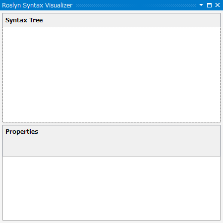
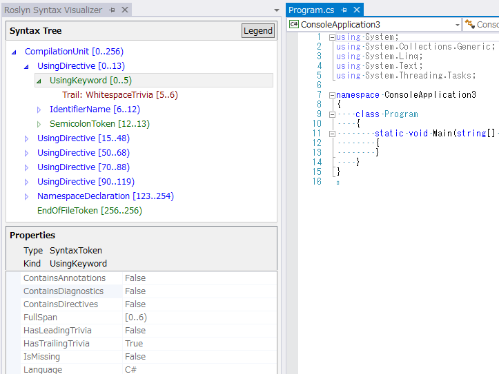
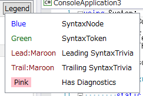

# Syntax Visualizer 概要

原文：[Syntax Visualizer Overview](http://roslyn.codeplex.com/wikipage?title=Syntax%20Visualizer)

[PDFのダウンロード](http://www.codeplex.com/Download?ProjectName=roslyn&DownloadId=823148)
または
[Word docxのダウンロード](http://www.codeplex.com/Download?ProjectName=roslyn&DownloadId=823147)

## コンテンツ

* [はじめに](#getting_started)
* [Syntax Visualizer](#syntax_visualizer)
* [Syntax Graphs](#syntax_graphs)
* [セマンティクスの調査](#inspecting_semantics)
* [Syntax Visualizerの閉じ方/無効化](#closing_disabling_syntax_visualizer)
* [フィードバック](#feedback)

このドキュメントでは.NET Compiler Platform ("Roslyn") SDK Previewとともに
リリースされるSyntax Visualizerツールについての概要を説明します。
Syntax VisualizerはVisual Studioの拡張機能で、
Roslynのシンタックスツリーを調査したり、検索したりすることができるため、
.NET Compiler Platform ("Roslyn") APIを仕様するアプリケーションを
独自に開発する際に、アプリケーションをデバッグするツールとして使うことができます。

##  はじめに

まず
[.NET Compiler Platform ("Roslyn") SDK Preview](http://go.microsoft.com/fwlink/?LinkId=394641)
をダウンロードします。
同梱のReadmeファイルにはSyntax Visualizerのインストール方法やその他の詳細について
説明があるので、まずはこのファイルを読んでおくとよいでしょう。

本ドキュメントに登場する概念を理解しやすくするためにも、
[Roslynの概要](overview.md) を読んでおくことを強く推奨します。
このドキュメントにはシンタックスツリーやノード、トークン、トリヴィアなど、
.NET Compiler Platform ("Roslyn") APIの概要についての説明が
かなりいい具合にまとめられています。

##  Syntax Visualizer

インストールが完了すると、Visual Studio IDE上でオープンしている C# または VB の
任意のコードに対するシンタックスツリーを
Syntax Visualizer上で調査できるようになります。
Visualizerは[表示]-[その他のウィンドウ]-[Roslyn Syntax Visualizer]から起動できます。

図1 Syntax Visualizerの起動

すると以下のようなウィンドウが表示されます。
このツールウィンドウはVisual Studio内の適当な位置にドッキングしておくとよいでしょう。
筆者としてはよく左側にドッキングさせています。

図2 Syntax Visualizerツールウィンドウ

次に[ファイル]-[新規作成]を選択してプロジェクトを作成します。
VB と C# のどちらでも構いません。
Visual Studioでこのプロジェクトがオープンされると同時に、
Visualizerツールウィンドウ内ではファイルに対するシンタックスツリーが
以下の図のように表示されます。
複数のコードファイルをVisual Studioで表示している場合には、
現在アクティブなウィンドウ(つまりキーボードがフォーカスされているウィンドウ)に
表示されているコードに対するシンタックスツリーが
常に表示されるという点に注意してください。

図3 C#のシンタックスツリーを可視化

図4 VBのシンタックスツリーを可視化

上の図からもわかるように、Visualizerツールウィンドウの上部にはシンタックスツリー、
下部にはプロパティグリッドが表示されます。
プロパティグリッドには.NETの「型」や項目の「カインド」(SyntaxKind)も含めて、
ツリー内で現在選択されている項目のプロパティが表示されます。

シンタックスツリーにはノードとトークン、トリヴィアという3つの種類の項目が含まれます。
これらの詳細については [.NET Compiler Platform ("Roslyn") 概要](overview.md)
のドキュメントを参照してください。
それぞれの型の項目は異なる色で表示されます。
「Legend」というタイトルのボタンをクリックすると、それぞれどの色が何に対して
使用されているのかを確認できます。

図5 Legend

ツリー内の項目にはそれぞれ固有の「スパン」があります。
たとえば先の C# の例であれば、選択中の `UsingKeyword [0..5)` トークンは
5文字幅、つまり[0..5)というスパンを持ちます。

ツリーはいくつかの方法で操作することができます：

* ツリー内の項目を展開したりクリックしたりすることで操作できます。
  Visualizerに表示されているツリー内の項目をクリックすると、
  項目のSpanに対応するコードがコードエディタ上で自動的に選択されます。
* コードエディタ上でテキストをクリックしたり、選択することで操作することもできます。
  たとえば先ほどのVBコードの場合、コードエディタ上で `Module Module1`
  の行を選択すると、それに対応してVisualizerで自動的に `ModuleStatement` ノードが
  選択状態になります。
  基本的にVisualizerは選択したテキストのスパンに最も適した項目を見つけて
  ハイライト表示させようとします。

次にアクティブなコードファイル上でコードを編集すると何が起こるか確認してみましょう。
上の例で、`Main()` の内側で `Console.WriteLine()` を呼び出すようにします。
そうすると入力している間もVisualizerがコードに沿って
更新されていくことがわかるでしょう。

`Console.` と入力した時点で入力を止めてみます。
そうするとツリーのいくつかの項目がピンクで表示されていることがわかります。
これはつまり、現時点では入力中のコードにエラー
(Diagnostics(診断情報)と呼ばれることもあります)
があるということを表しています。
これらのエラーはシンタックスツリー内のノードやトークン、トリヴィアに添付され、
Visualizer上では特別な色で表示することにより、それぞれにエラーが添付されている
ことがわかるようになっています。
エラーの詳細は、ピンク色になっている項目の上にマウスを移動させることで確認できます。
なおVisualizerは文法的なエラーだけを表示していることに注意してください
(つまり入力されたコードの文法エラーに関連するものだけです)。
意味的なエラーについては表示されません。

##  Syntax Graphs

##  セマンティクスの調査

##  Syntax Visualizerの閉じ方/無効化

##  フィードバック
