# Syntax Visualizer 概要

原文：[Syntax Visualizer Overview](http://roslyn.codeplex.com/wikipage?title=Syntax%20Visualizer)

[PDFのダウンロード](http://www.codeplex.com/Download?ProjectName=roslyn&DownloadId=823148)
または
[Word docxのダウンロード](http://www.codeplex.com/Download?ProjectName=roslyn&DownloadId=823147)

## コンテンツ

* [はじめに](#getting_started)
* [Syntax Visualizer](#syntax_visualizer)
* [Syntax Graphs](#syntax_graphs)
* [セマンティクスの調査](#inspecting_semantics)
* [Syntax Visualizerの閉じ方/無効化](#closing_disabling_syntax_visualizer)
* [フィードバック](#feedback)

このドキュメントでは.NET Compiler Platform ("Roslyn") SDK Previewとともに
リリースされるSyntax Visualizerツールについての概要を説明します。
Syntax VisualizerはVisual Studioの拡張機能で、
Roslynのシンタックスツリーを調査したり、検索したりすることができるため、
.NET Compiler Platform ("Roslyn") APIを仕様するアプリケーションを
独自に開発する際に、アプリケーションをデバッグするツールとして使うことができます。

##  はじめに

まず
[.NET Compiler Platform ("Roslyn") SDK Preview](http://go.microsoft.com/fwlink/?LinkId=394641)
をダウンロードします。
同梱のReadmeファイルにはSyntax Visualizerのインストール方法やその他の詳細について
説明があるので、まずはこのファイルを読んでおくとよいでしょう。

本ドキュメントに登場する概念を理解しやすくするためにも、
[Roslynの概要](overview.md) を読んでおくことを強く推奨します。
このドキュメントにはシンタックスツリーやノード、トークン、トリヴィアなど、
.NET Compiler Platform ("Roslyn") APIの概要についての説明が
かなりいい具合にまとめられています。

##  Syntax Visualizer

インストールが完了すると、Visual Studio IDE上でオープンしている C# または VB の
任意のコードに対するシンタックスツリーを
Syntax Visualizer上で調査できるようになります。
Visualizerは[表示]-[その他のウィンドウ]-[Roslyn Syntax Visualizer]から起動できます。

図1 Syntax Visualizerの起動

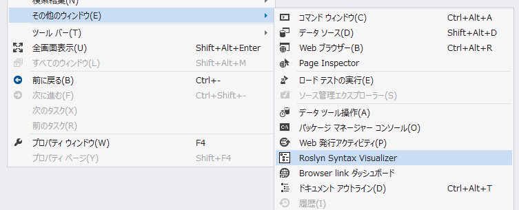

すると以下のようなウィンドウが表示されます。
このツールウィンドウはVisual Studio内の適当な位置にドッキングしておくとよいでしょう。
筆者としてはよく左側にドッキングさせています。

図2 Syntax Visualizerツールウィンドウ

次に[ファイル]-[新規作成]を選択してプロジェクトを作成します。
VB と C# のどちらでも構いません。
Visual Studioでこのプロジェクトがオープンされると同時に、
Visualizerツールウィンドウ内ではファイルに対するシンタックスツリーが
以下の図のように表示されます。
複数のコードファイルをVisual Studioで表示している場合には、
現在アクティブなウィンドウ(つまりキーボードがフォーカスされているウィンドウ)に
表示されているコードに対するシンタックスツリーが
常に表示されるという点に注意してください。

図3 C#のシンタックスツリーを可視化

図4 VBのシンタックスツリーを可視化

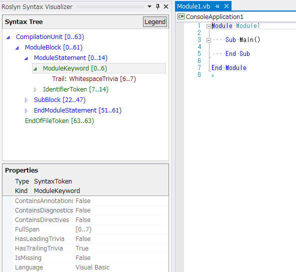

上の図からもわかるように、Visualizerツールウィンドウの上部にはシンタックスツリー、
下部にはプロパティグリッドが表示されます。
プロパティグリッドには.NETの「型」や項目の「カインド」(SyntaxKind)も含めて、
ツリー内で現在選択されている項目のプロパティが表示されます。

シンタックスツリーにはノードとトークン、トリヴィアという3つの種類の項目が含まれます。
これらの詳細については [.NET Compiler Platform ("Roslyn") 概要](overview.md)
のドキュメントを参照してください。
それぞれの型の項目は異なる色で表示されます。
「Legend」というタイトルのボタンをクリックすると、それぞれどの色が何に対して
使用されているのかを確認できます。

図5 Legend

ツリー内の項目にはそれぞれ固有の「スパン」があります。
たとえば先の C# の例であれば、選択中の `UsingKeyword [0..5)` トークンは
5文字幅、つまり[0..5)というスパンを持ちます。

ツリーはいくつかの方法で操作することができます：

* ツリー内の項目を展開したりクリックしたりすることで操作できます。
  Visualizerに表示されているツリー内の項目をクリックすると、
  項目のSpanに対応するコードがコードエディタ上で自動的に選択されます。
* コードエディタ上でテキストをクリックしたり、選択することで操作することもできます。
  たとえば先ほどのVBコードの場合、コードエディタ上で `Module Module1`
  の行を選択すると、それに対応してVisualizerで自動的に `ModuleStatement` ノードが
  選択状態になります。
  基本的にVisualizerは選択したテキストのスパンに最も適した項目を見つけて
  ハイライト表示させようとします。

次にアクティブなコードファイル上でコードを編集すると何が起こるか確認してみましょう。
上の例で、`Main()` の内側で `Console.WriteLine()` を呼び出すようにします。
そうすると入力している間もVisualizerがコードに沿って
更新されていくことがわかるでしょう。

`Console.` と入力した時点で入力を止めてみます。
そうするとツリーのいくつかの項目がピンクで表示されていることがわかります。
これはつまり、現時点では入力中のコードにエラー
(Diagnostics(診断情報)と呼ばれることもあります)
があるということを表しています。
これらのエラーはシンタックスツリー内のノードやトークン、トリヴィアに添付され、
Visualizer上では特別な色で表示することにより、それぞれにエラーが添付されている
ことがわかるようになっています。
エラーの詳細は、ピンク色になっている項目の上にマウスを移動させることで確認できます。
なおVisualizerは文法的なエラーだけを表示していることに注意してください
(つまり入力されたコードの文法エラーに関連するものだけです)。
意味的なエラーについては表示されません。

##  Syntax Graphs

ツリー内の項目上で右クリックして [View Directed Syntax Graph] を選択すると、
選択した項目をルートにしたサブツリーをグラフとして表示できます。
先のC#のコードにて、 `Main()` メソッドに対応する
`MethodDeclaratoin` ノードで試してみましょう。
そうすると以下のようなシンタックスグラフ(Syntax Graphs)が表示されるはずです：

図6 C#のシンタックスグラフの表示

図7 C#のシンタックスグラフ

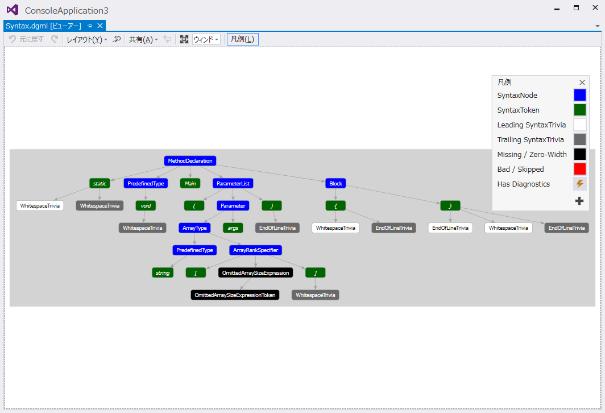

次にVBのコードにて、 `Main()` メソッドに対応する
`SubBlock` ノードでシンタックスグラフを表示させてみます。
そうすると以下のように表示されるでしょう：

図8 VBのシンタックスグラフの表示

図9 VBのシンタックスグラフ

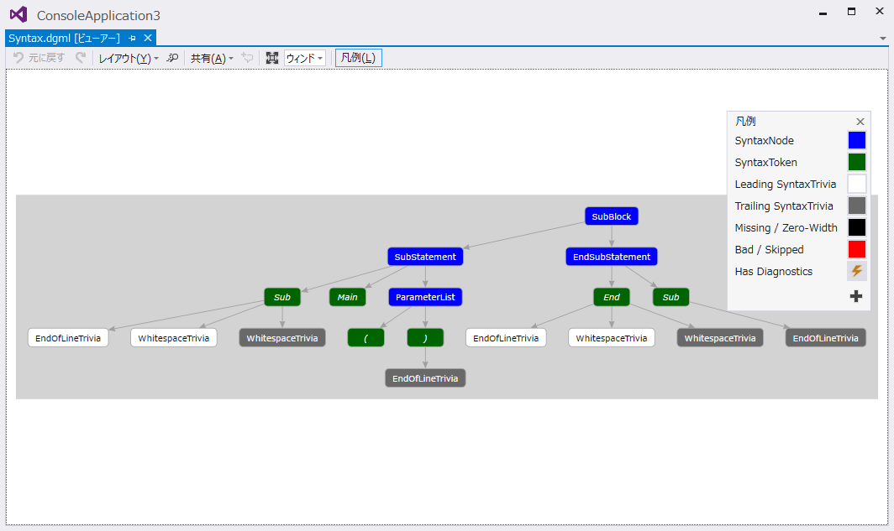

上のスクリーンショットからもわかるように、シンタックスグラフビューアには
ビューアで使用されているカラースキーマに対する凡例(Legend)を表示する
オプションがあります。
また、それぞれの項目上にマウスを乗せると、その項目のプロパティ一覧を
ポップアップ表示できます。

シンタックスグラフはツリー内の項目に対して何度も表示させることができますが、
常に同じVisual Studioウィンドウ内に表示されます。
このウィンドウをVisual Studioにドッキングしておけば、
新しいシンタックスグラフを表示させた場合でもタブを切り替えずに済ませられます。
筆者はこのウィンドウをよく下部(コードエディタの下)にドッキングさせています。

図10 筆者のおすすめするドッキングレイアウト

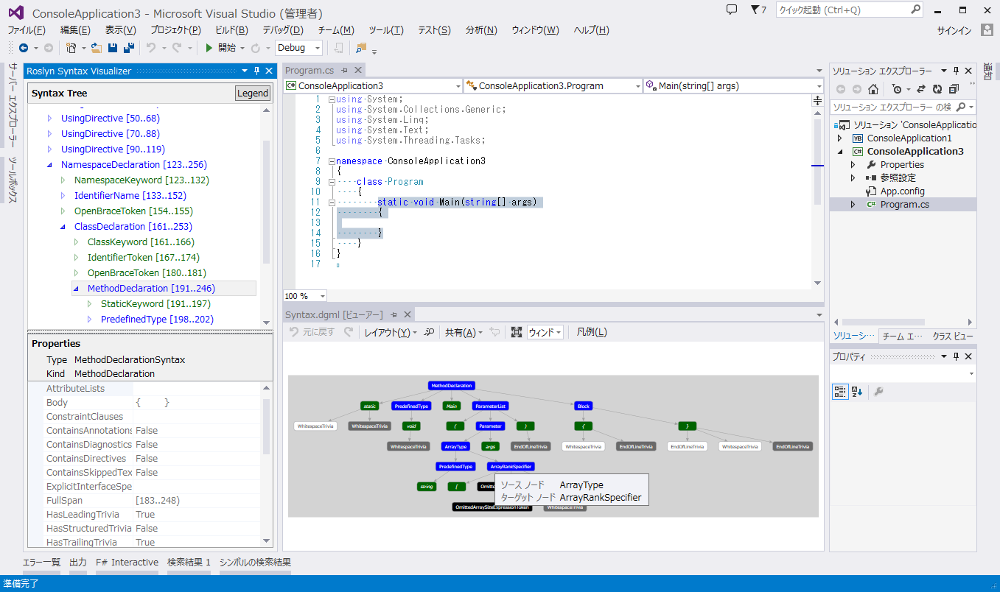

##  セマンティクスの調査

Syntax Visualizerにはシンボルやセマンティクスの情報を調査するための
基本的な機能がいくつか用意されています。
いくつか例を紹介しましょう。
セマンティクスの分析に関連するAPIについては
[.NET Compiler Platform ("Roslyn") 概要](overview.md)
のドキュメントを参照してください。

先のC#プロジェクトにおいて、 `Main()` 内に `double x = 1 + 1;` と入力します。

そしてコードエディタウィンドウで `1 + 1` の式を選択します。
するとVisualizer上ではこのコードに対応した `AddExpression` ノードが
ハイライト表示されます。
`AddExpression` ノード上で右クリックから **View Symbol (if any)** を選択します。

図11 式に対するシンボルを表示する

Visualizerのプロパティグリッドが更新されて、式に対するシンボルが
`Kind = Method`のSynthesizedIntrinsicOperatorSymbolであることが確認できます。

図12 Symbol プロパティ

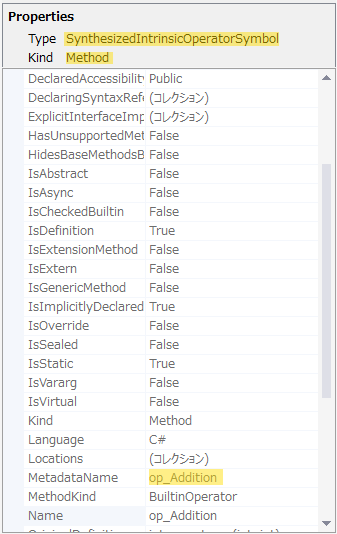

次に同じ `AddExpression` ノード上で **View TypeSymbol (if any)** を選択します。
今度は選択した式の型が `Int32` だということがVisualizerの
プロパティグリッドから確認できます。

図13 TypeSymbol プロパティ

次に同じ `AddExpression` ノード上で **View Converted TypeSymbol (if any)**
を選択します。
今度は式の型としては `Int32` だったものの、式を変換した後の型は `Double`
になるということが確認できます
(これは割り当て演算子の左側にある変数 `x` の型に合わせて、
 `Int32` の式を `Double` に変換する必要があるためです)。

図14 Converted TypeSymbol プロパティ

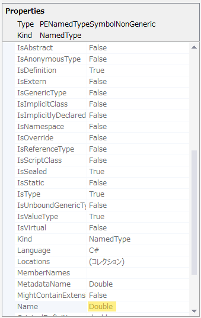

最後に、やはり同じ `AddExpression` ノード上で **View Constant Value (if any)** を
選択します。
プロパティグリッド上では式の値がコンパイル時定数 `2` となることが確認できます。

図15 定数値

これまでの調査結果はVBの場合でも同じです。
VBファイル内で `Dim x As Double = 1 + 1` と入力して、
コードエディタ上で `1 + 1` を選択します。
するとVisualizer上で `AddExpression` ノードがハイライト表示されるので、
上の手順を `AddExpression` に対して実行すれば全く同じ結果が確認できるでしょう。

今度はVBで別の例を試してみましょう。
VBファイルのコードを以下の図と同じになるように変更してください。
このコードでは1行目で `C` という(System.Consoleへの)エイリアスを定義して、
これを `Main()` 内で使用しています。
`Main()` 内のエイリアスを使用しているコードを選択します(下図を参照)。
するとVisualizer上では対応する `IdentifierName` ノードがハイライト表示されます。
右クリックから **View Symbol (if any)** を選択します。

図16 識別子に対するシンボルを表示する

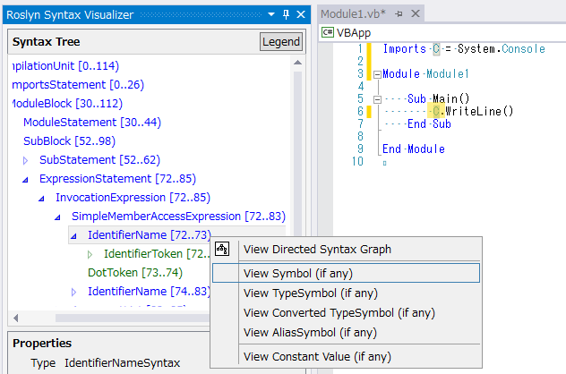

プロパティグリッドから、この識別子が `System.Console` に
結びつけられていることが確認できます。

図17 Symbol プロパティ

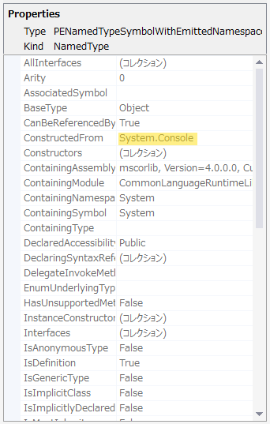

次に、同じ `IdentifierName` ノードで **View AliasSymbol (if any)** を選択します。
するとこの識別子が `System.Console` をTargetとするような `C` という
エイリアスであることがプロパティグリッドで確認できます。
別の言い方をすると、識別子 `C` と関連した `AliasSymbol` の情報が
プロパティグリッドで表示されたというわけです。

図18 AliasSymbol プロパティ

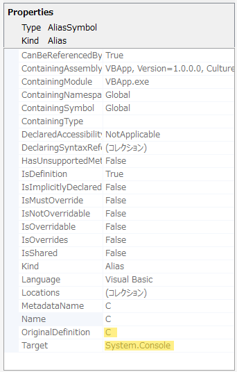

なおVisualizerにて、各ノード上でView Symbol (if any)を選択すれば、
宣言された型やメソッド、プロパティなど、様々なものに対するシンボルが
調査できます。
たとえば先ほどの例で `Sub Main()` をコードエディタで選択した後、
Visualizer上で `SubBlock` を選択してView Symbol (if any)をクリックすると、
`SubBlock` の名前が `Main` で、返り値が `Void` の `MethodSymbol` であることが
プロパティグリッドで確認できます。

図19 メソッド宣言に対するシンボルを表示

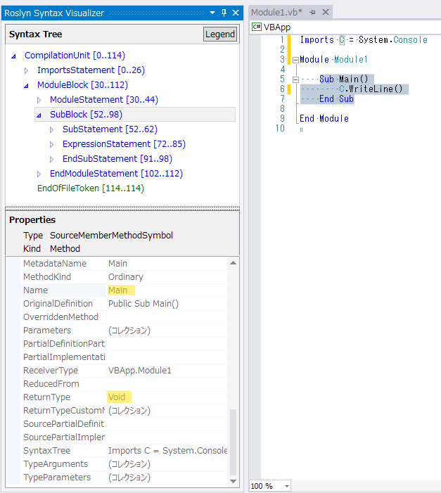

この VB の例は簡単に C# へ移植できます
(エイリアスを定義するには `Imports C = System.Console` と同じように
 `using C = System.Console;` と入力します)。
C# で上と同じ操作をすれば同じ結果が得られます。

これまでに説明した、シンボルの意味を調査する操作はノードに対してのみ有効で、
トークンやトリヴィアには行えないことに注意してください。
また、必ずしもすべてのノードが興味深い意味的情報を持つとは
限らないことにも注意してください。
有効な意味的情報を持たないノードに対して **View \*Symbol (if any)** を
クリックしても何も起こりません(つまり有効な情報が返されません)。
このように、有効な意味的情報が返されなかった場合には
Visualizerのプロパティグリッドが空になります。

図20 選択したノードに対して有効な意味的情報がない場合は空のプロパティグリッドが表示される

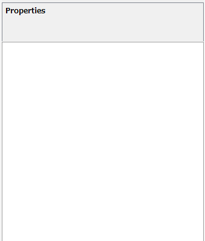

##  Syntax Visualizerの閉じ方/無効化

Visualizerツールウィンドウは任意のタイミングで閉じることができ、
閉じたとしても何の影響もないはずです。
また、Visual Studioの[ツール]-[拡張機能と更新プログラム]メニューから
Visualizer拡張機能を無効化したりアンインストールしたりすることができます。

##  フィードバック

どうか皆さんがSyntax Visualizerツールを使用して楽しく学習することが
出来ますように願っています。
このツールを試してコードを探索したり、
.NET Compiler Platform (“Roslyn”) API を使った機能豊富な
アプリケーションや拡張機能を作成したりしてみてください。

我々はこのテクノロジープレビューを皆さんが手に取られることを
とてもうれしく思うと同時に、プレビューに関する一般的な事項や
Syntax Visualizerツールも含めて、是非フィードバックやアイディア、
提案などいただければ幸いです。
Visualizerに関する一般的なフィードバックについては
[こちら](https://roslyn.codeplex.com/discussions/topics/6001/general)、
問題を発見した場合には
[こちら](https://roslyn.codeplex.com/workitem/list/basic)
から報告をお願いします。
また、プレビューに関する様々なフィードバック方法の一覧については
[こちら](http://roslyn.codeplex.com/wikipage?title=Questions%2c%20Comments%2c%20and%20Feedback)
を参照してください。
