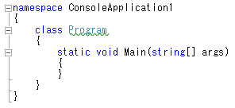
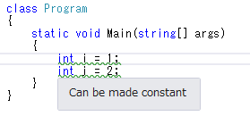
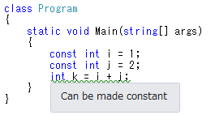
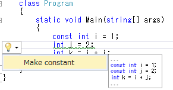

# How To: C#による診断機能およびコード修正機能を実装する方法

原文：[How To: Write a C# Diagnostic and Code Fix](http://www.codeplex.com/Download?ProjectName=roslyn&DownloadId=822458)

2014年4月

## はじめに

これまでにリリースされているVisual Studioでは C# や Visual Basic を
対象とする警告機能を独自に実装することは簡単ではありません。
しかし .NET Compiler Platform ("Roslyn") の診断用APIを使用すれば
この難しい機能が簡単に実現できます！
必要になるのは問題を特定するための分析処理を行うことだけです。
また、場合によってはツリーの変形を行うことでコードを修正することも可能です。
バックグラウンドスレッドで分析処理を実行開始したり、
エディタ上で波状の下線を表示したり、
Visual Studioのエラーリストに項目を追加したり、
修正案の通知のために「電球マーク」を用意したり、
リッチなプレビューを表示したりといった複雑な処理はいずれも自動的に行われます。

このウォークスルーではRoslynのAPIを使用して診断機能(Diagnostic)を作成し、
さらにコード修正機能(Code Fix)も追加します。
診断機能とはソースコードの分析を行い、問題をユーザーに通知する機能のことです。
また診断機能のオプションとして、ユーザーの作成したソースコードに対する
変更を提案するコード修正機能を実装することもできます。
たとえば大文字で始まるローカル変数名をすべて検出するような診断機能を作成し、
さらにそれらの変数名を小文字始まりに修正するような
コード修正機能を実装したりできます。

## 診断機能を実装する

たとえば任意のローカル変数宣言に対して、
それがローカル定数に変換出来る場合には警告表示するような機能を実装したいとします。
つまり以下のようなコードがあるとします：

```csharp
int x = 0;
Console.WriteLine(x);
```

このコードにある `x` には定数値が割り当てられ、変更されていません。
したがってこの宣言には `const` 修飾子を追加できます：

```csharp
const int x = 0;
Console.WriteLine(x);
```

変数が定数に変換可能かどうかを検出する機能は実際にはやや複雑で、
文法的な解析を行い、初期化子の式が定数かどうかを解析し、
変数が決して変更されていないことを確認する必要があります。
しかし .NET Compiler Platform を使用すれば非常に簡単に
この解析機能を実装し、診断機能として公開することができます。

1. まず C# Diagnostic プロジェクトを新規作成します。
  * Visual Studioで[ファイル]-[新規作成]-[プロジェクト]を選択して
    [新しいプロジェクト]ダイアログを表示します。
  * [Visual C#]-[Roslyn] 以下から [Diagnostic with Code Fix] を選択します。
  * プロジェクトの名前を **`FirstDiagnostic`** として[OK]をクリックします。
    
    
2. `Ctrl+F5` キーを押して、Roslyn Previewの拡張機能が読み込まれた
   2つめのVisual Studio上でこの新規作成した診断機能プロジェクトを実行します。
  * 起動した2つめのVisual Studioインスタンス上でC# コンソールアプリケーション
    プロジェクトを新規作成します。
    すると波状の下線がトークンにホバー表示され、診断機能で指定された
    警告文が表示されます。
    
    波状の下線が表示されない場合には[ツール]-[拡張機能と更新プログラム]を開いて
    Roslyn Previewが有効になっていることを確認してください。
    Roslyn Previewがリストに表示されていない場合にはSDK Previewの
    .zipファイル内にある `Install Roslyn Preview into Roslyn Experimental Hive.exe`
    を実行する必要があるでしょう。
    
    この診断機能はデバッガープロジェクトの `AnalyzeSymbol` メソッドで
    実装されています。
    したがってC#ファイル内にあって小文字を識別子名に含むような、
    すべての型宣言を検出するコードが初期状態でデバッガープロジェクトには
    用意されているというわけです。
    
    
  * 初期状態の診断機能が確認出来たので、2つめのVisual Studioインスタンスを終了して
    診断機能プロジェクトに戻ります。
3. 診断分析機能を実装している、プロジェクト内のDiagnosticAnalyzer.csファイルを
   少し確認してみましょう。
   注意すべき点は以下の2点です：
  * 診断分析機能にはいずれも `[ExportDiagnosticAnalyzer]` 属性を
    指定する必要があります。
    この属性には診断機能IDや対象とする言語など、重要な項目を設定します。
    なお現時点ではさらに `[DiagnosticAnalyzer]` 属性も指定する必要があります。
    これは既知の不具合です。
  * 診断分析機能では `IDiagnosticAnalyzer` 派生のインターフェイスを
    1つ以上実装する必要があります。
    今回の場合、テンプレートではデフォルトで `ISymbolAnalyzer` インターフェイスが
    実装されています。
    このインターフェイスでは `AnalyzeSymbol` と呼ばれるメソッドを
    実装する必要があります。
    このメソッドは対象のコードにおいてシンボルの宣言が変更されたり、
    シンボルが追加されたりした場合に毎回呼ばれます。
4. 今回実装する、ローカル変数を定数に変換可能かどうか解析する機能に対しては、
   いくつかの実装方法が考えられます。
   直感的な方法としては `ISyntaxNodeAnalyzer<TSyntaxKind>` インターフェイスを
   実装して、ローカル宣言に対するシンタックスノードを一度に1つずつ
   チェックしていき、初期化子が定数であることを確認することになります。
   そのため、まずは以下の操作を行います：
  * `DiagnosticAnalyzer` 型に実装されている `ISymbolAnalyzer` インターフェイスを
    `ISyntaxNodeAnalyzer<SyntaxKind>` に変更します。
    波線が表示されている `SyntaxKind` 型の位置で `Ctrl+.` キーを押して
    `Microsoft.CodeAnalysis.CSharp` 名前空間のusingを追加します。
    型宣言の上にあるTODOのコメントを削除します。
  * 既に実装されているメンバー `SymbolKindsOfInterest` および `AnalyzeSymbol` を
    削除します。
    これらは使用されません。
  * `ISyntaxNodeAnalyzer<SyntaxKind>` が実装されていないことを示す
    赤い波線が表示されるので、 `DiagnosticAnalyzer` をクリックします。
    `Ctrl+.` を押して Implement interface を選択し、
    `SyntaxKindsOfInterest` と `AnalyzeNode` のひな形を追加します。
  * `LocaldeclarationStatement` が対象とする `SyntaxKind` であることを示すように
    `SyntaxKindsOfInterest` プロパティを実装します。
    
    ```csharp
    return ImmutableArray.Create(SyntaxKind.LocalDeclarationStatement);
    ```
  * 定数化のルールに一致するよう、型定義の先頭にある `internal const string` で
    定義された診断機能のメタデータを更新します。
    
    ```csharp
    internal const string DiagnosticId = "MakeConst";
    internal const string Description = "Make Constant";
    internal const string MessageFormat = "Can be made constant";
    internal const string Category = "Usage";
    ```
  * 以上の手順を行った後、`DiagnosticAnalyzer.cs` のコードは
    以下のようになっているはずです：
    
    ```csharp
    using System;
    using System.Collections.Generic;
    using System.Collections.Immutable;
    using System.Linq;
    using System.Threading;
    using Microsoft.CodeAnalysis;
    using Microsoft.CodeAnalysis.CSharp;
    using Microsoft.CodeAnalysis.Diagnostics;

    namespace FirstDiagnostic
    {
        [DiagnosticAnalyzer]
        [ExportDiagnosticAnalyzer(DiagnosticId, LanguageNames.CSharp)]
        public class DiagnosticAnalyzer : ISyntaxNodeAnalyzer<SyntaxKind>
        {
            internal const string DiagnosticId = "MakeConst";
            internal const string Description = "Make Constant";
            internal const string MessageFormat = "Can be made constant";
            internal const string Category = "Usage";

            internal static DiagnosticDescriptor Rule = new DiagnosticDescriptor(DiagnosticId, Description, MessageFormat, Category, DiagnosticSeverity.Warning);

            public ImmutableArray<DiagnosticDescriptor> SupportedDiagnostics { get { return ImmutableArray.Create(Rule); } }

            public ImmutableArray<SyntaxKind> SyntaxKindsOfInterest
            {
                get
                {
                    return ImmutableArray.Create(SyntaxKind.LocalDeclarationStatement);
                }
            }

            public void AnalyzeNode(SyntaxNode node, SemanticModel semanticModel, Action<Diagnostic> addDiagnostic, CancellationToken cancellationToken)
            {
                throw new NotImplementedException();
            }
        }
    }
    ```
  * これでローカル変数が定数化できるかどうか判断するロジックを
    `AnalyzeNode` メソッドに作成する準備が整いました。
5. まず文法的な解析を行う必要があります。
  * `AnalyzeNode` メソッドで引数 `node` を `LocalDeclaratoinStatementSyntax` 型に
    キャストします。
    `SyntaxKindsOfInterest` プロパティの実装により、この型のシンタックスノードだけが
    対象となるように診断用アナライザーが動作するため、直接キャストしても
    エラーにならないとみなすことができます。
    `Ctrl+.` キーを押して、ここで必要となる`Microsoft.CodeAnalysis.CSharp.Syntax`
    名前空間に対するusingステートメントを追加します。
    
    ```csharp
    var localDeclaration = (LocalDeclarationStatementSyntax)node;
    ```
  * ローカル変数に `const` 修飾子が既に付けられていないことを確認します。
    変数が既にconstとして宣言されている場合にはこれ以上の診断を行わず、
    早い段階で処理を終了させます。
    
    ```csharp
    // constとして宣言されていないローカル変数だけを対象とします。
    if (localDeclaration.Modifiers.Any(SyntaxKind.ConstKeyword))
    {
        return;
    }
    ```
6. 次に `SemanticModel` 型の引数を使用して、ローカル変数が定数化できるかどうか、
   文法的な解析処理をいくつか行います。
   `SemanticModel` は1つのソースファイル中にあるすべての文法情報を表すものです。
   セマンティックモデルの詳細については
   [.NET Compiler Platform プロジェクト概要](../overview.md)
   を参照してください。
  * 宣言されている変数が初期化子を持つことを確認します。
    C#の仕様として、すべての定数は必ず初期化されなければならないため、
    必ずこれを確認しておきます。
    たとえば `int x = 0, y = 1;` は定数化できますが、 `int x, y = 1` は出来ません。
    また、`SemanticModel` を使用して変数の初期化子がコンパイル時定数であることを
    確認します。
    これは変数の初期化子それぞれに対して `SemanticModel.GetConstantValue()`
    を呼び出し、返り値 `Otional<object>` が値を持つかどうかチェックすることで
    確認できます。
    
    ```csharp
    // ローカルで宣言されたすべての変数に対して
    // 定数値が割り当てられているかどうかを確認します。
    foreach (var variable in localDeclaration.Declaration.Variables)
    {
        var initializer = variable.Initializer;
        if (initializer == null)
        {
            return;
        }

        var constantValue = semanticModel.GetConstantValue(initializer.Value);
        if (!constantValue.HasValue)
        {
            return;
        }
    }
    ```
  * `SemanticModel` を使用して、ローカルで宣言されたステートメントに対する
    データフローを解析します。
    そしてデータフロー解析の結果を使用して、ローカル変数が別の場所で
    書き換えられていないことを確認します。
    これは各変数に対して `SemanticModel.GetDeclaredSymbol` メソッドを呼び、
    返された `ILocalSymbol` がデータフロー解析の `WrittenOutside` コレクションに
    含まれていないことをチェックすることで確認できます。
    
    ```csharp
    // ローカル宣言に対してデータフロー解析を行います。
    var dataFlowAnalysis = semanticModel.AnalyzeDataFlow(localDeclaration);

    // ローカルに宣言された各変数に対するローカルシンボルを取得し、
    // データフロー解析の領域外で書き換えられていないことを確認します。
    foreach (var variable in localDeclaration.Declaration.Variables)
    {
        var variableSymbol = semanticModel.GetDeclaredSymbol(variable);
        if (dataFlowAnalysis.WrittenOutside.Contains(variableSymbol))
        {
            return;
        }
    }
    ```
7. 必要なすべての解析を行った後は、非定数の変数宣言に対する警告を表す
   `Diagnostic` オブジェクトを新規作成します。
   この `Diagnostic` オブジェクトにはコードの上方で定義されている
   `Rule` テンプレートをメタデータとして設定します。
   そして `addDiagnostic` デリゲートの引数として渡すことによって警告を通知できます。
   
   ```csharp
   addDiagnostic(Diagnostic.Create(Rule, node.GetLocation()));
   ```
   
   この時点で `AnalyzeNode` メソッドは以下のようになっているはずです：
   
   ```csharp
   public void AnalyzeNode(SyntaxNode node, SemanticModel semanticModel, Action<Diagnostic> addDiagnostic, CancellationToken cancellationToken)
   {
       var localDeclaration = (LocalDeclarationStatementSyntax)node;
   
       // constとして宣言されていないローカル変数だけを対象とします。
       if (localDeclaration.Modifiers.Any(SyntaxKind.ConstKeyword))
       {
           return;
       }
   
       // ローカルで宣言されたすべての変数に対して
       // 定数値が割り当てられているかどうかを確認します。
       foreach (var variable in localDeclaration.Declaration.Variables)
       {
           var initializer = variable.Initializer;
           if (initializer == null)
           {
               return;
           }
   
           var constantValue = semanticModel.GetConstantValue(initializer.Value);
           if (!constantValue.HasValue)
           {
               return;
           }
       }
   
       // ローカル宣言に対してデータフロー解析を行います。
       var dataFlowAnalysis = semanticModel.AnalyzeDataFlow(localDeclaration);
   
       // ローカルに宣言された各変数に対するローカルシンボルを取得し、
       // データフロー解析の領域外で書き換えられていないことを確認します。
       foreach (var variable in localDeclaration.Declaration.Variables)
       {
           var variableSymbol = semanticModel.GetDeclaredSymbol(variable);
           if (dataFlowAnalysis.WrittenOutside.Contains(variableSymbol))
           {
               return;
           }
       }
   
       addDiagnostic(Diagnostic.Create(Rule, node.GetLocation()));
   }
   ```
8. `Ctrl+F5` を押して、Roslyn Preview拡張機能がロードされた2つめのVisual Studio
   インスタンス上で診断機能プロジェクトを実行します。
  * 2つめのVisual Studioインスタンス上でC# コンソール アプリケーションプロジェクトを
    作成して、`Main` メソッドの中で定数値で初期化されたローカル変数宣言を
    いくつか追加します。
    
    ```csharp
    ```
  * 以下のような警告が表示されます。
    
    
  * また、それぞれの変数の前に `const` を追加すると警告が自動的に消えます。
    さらに、定数化された変数は他の変数にも影響することが確認できます。
    
    
9. おめでとうございます！
   これで.NET Compiler Platform APIを使用して、
   やや複雑な文法的ならびに意味的解析を行い、
   初めての診断機能を実装することができました。

## コード修正機能を実装する

診断機能には、報告された問題に対するソースコードを編集するコード修正機能を
1つ以上実装できます。
先ほど作成した診断機能の場合、ユーザーがエディタ上で電球UIをクリックすれば
constキーワードを挿入するようなコード修正機能が実装できます。
具体的には以下の手順で行います。

1. まず Diagnostic with Code Fix のテンプレートにより既に追加されている
   `CodeFixProvider.cs` ファイルを開きます。
   このコード修正機能には診断アナライザーと同じ診断機能IDが関連づけられていますが、
   コード変換機能はまだ実装されていません。
2. `MakeUppercaseAsync` メソッドを削除します。
   このメソッドは使用されません。
3. `GetFixesAsync` メソッドにて、検索対象が診断機能と一致するように
   `LocalDeclarationStatementSyntax` に変更します。
    
    ```csharp
    // 診断機能によって識別されたローカル宣言を検索します。
    var declaration = root.FindToken(diagnosticSpan.Start).Parent.AncestorsAndSelf().OfType<LocalDeclarationStatementSyntax>().First();
    ```
4. `CodeAction` オブジェクトを生成している最終行を変更して、
   これから定義することになる `MakeConstAsync` メソッドを呼び出すようにします。
   またTODOコメントも削除します。
   各 `CodeAction` はユーザーがVisual Studio上で選択できる項目をそれぞれ表します。
    
    ```csharp
    return new[] { CodeAction.Create("Make constant", c => MakeConstAsync(document, declaration, c)) };
    ```
5. この時点でコードは以下のようになっているはずです：
    
    ```csharp
    using System.Collections.Generic;
    using System.Linq;
    using System.Threading;
    using System.Threading.Tasks;
    using Microsoft.CodeAnalysis;
    using Microsoft.CodeAnalysis.CodeFixes;
    using Microsoft.CodeAnalysis.CodeActions;
    using Microsoft.CodeAnalysis.CSharp;
    using Microsoft.CodeAnalysis.CSharp.Syntax;
    using Microsoft.CodeAnalysis.Rename;
    using Microsoft.CodeAnalysis.Text;
    
    namespace FirstDiagnostic
    {
        [ExportCodeFixProvider(DiagnosticAnalyzer.DiagnosticId, LanguageNames.CSharp)]
        internal class CodeFixProvider : ICodeFixProvider
        {
            public IEnumerable<string> GetFixableDiagnosticIds()
            {
                return new[] { DiagnosticAnalyzer.DiagnosticId };
            }
    
            public async Task<IEnumerable<CodeAction>> GetFixesAsync(Document document, TextSpan span, IEnumerable<Diagnostic> diagnostics, CancellationToken cancellationToken)
            {
                var root = await document.GetSyntaxRootAsync(cancellationToken).ConfigureAwait(false);
    
                // TODO: Replace the following code with your own analysis, generating a CodeAction for each fix to suggest
    
                var diagnosticSpan = diagnostics.First().Location.SourceSpan;
    
                // 診断機能によって識別されたローカル宣言を検索します。
                var declaration = root.FindToken(diagnosticSpan.Start).Parent.AncestorsAndSelf().OfType<LocalDeclarationStatementSyntax>().First();
    
                // Return a code action that will invoke the fix.
                return new[] { CodeAction.Create("Make constant", c => MakeConstAsync(document, declaration, c)) };
            }
        }
    }
    ```
6. そして `MakeConstAsync` を実装します。
   このメソッドは元の `Document` を修正後の `Document` に変換します。
  * まず以下のシグネチャで `MakeConstAsync` を宣言します。
    このメソッドはユーザーのソースコードを表す `Document` を変換して、
    `const` 宣言を含んだ `Document` へと修正します。
    
    ```csharp
    private async Task<Document> MakeConstAsync(Document document, LocalDeclarationStatementSyntax localDeclaration, CancellationToken cancelationToken)
    ```
  * 次に宣言ステートメントの前に挿入されることになる
    `const` キーワードトークンを新規作成します。
    まず、宣言ステートメントの最初のトークンから前方トリヴィアを削除して、
    それを `const` トークンにアタッチしていることに注意してください。
    
    ```csharp
    // ローカル宣言から前方トリヴィアを削除します。
    var firstToken = localDeclaration.GetFirstToken();
    var leadingTrivia = firstToken.LeadingTrivia;
    var trimmedLocal = localDeclaration.ReplaceToken(firstToken, firstToken.WithLeadingTrivia(SyntaxTriviaList.Empty));
    
    // 前方トリヴィアを持ったconstトークンを作成します。
    var constToken = SyntaxFactory.Token(leadingTrivia, SyntaxKind.ConstKeyword, SyntaxFactory.TriviaList(SyntaxFactory.ElasticMarker));
    ```
  * 次に `const` トークンおよび既存の宣言ステートメントの修飾子を含んだ
    `SyntaxTokenList` を作成します。
    
    ```csharp
    // 修飾子リストにconstトークンを挿入して、新しい修飾子リストを作成します。
    var newModifiers = trimmedLocal.Modifiers.Insert(0, constToken);
    ```
  * 新しい修飾子リストを持った、新しい宣言ステートメントを作成します。
    
    ```csharp
    // 新しいローカルステートメントを作成します。
    var newLocal = trimmedLocal.WithModifiers(newModifiers);
    ```
  * 新しい宣言ステートメントに `Formatter` シンタックスアノテーションを追加します。
    これはコード修正エンジンがC#のフォーマット規則に従って空白文字を
    整形するようにさせるために必要です。
    なおFormatter型の上で `Ctrl+.` を押して、
    `Microsoft.CodeAnalysis.Formatting` 名前空間のusingステートメントを挿入する必要があります。
    
    ```csharp
    // 新しいローカル宣言を整形するためにアノテーションを追加します。
    var formattedLocal = newLocal.WithAdditionalAnnotations(Formatter.Annotation);
    ```
  * `Document` からルートの `SyntaxNode` を取得して、
    古い宣言ステートメントを新しいものに置き換えます。
    
    ```csharp
    // 古いローカル宣言を新しいローカル宣言に置き換えます。
    var oldRoot = await document.GetSyntaxRootAsync(cancellationToken);
    var newRoot = oldRoot.ReplaceNode(localDeclaration, formattedLocal);
    ```
  * 最後に、更新されたシンタックスルートを含む新しい `Document` を返します。
    この `Document` にはこれまで行ってきたツリー変換の結果が反映されています。
    
    ```csharp
    // 変換後のツリーを含むドキュメントを返します。
    return document.WithSyntaxRoot(newRoot);
    ```
  * この時点で `MakeConstAsync` メソッドは以下のようになっているはずです：
    
    ```csharp
    private async Task<Document> MakeConstAsync(Document document, LocalDeclarationStatementSyntax localDeclaration, CancellationToken cancellationToken)
    {
        // ローカル宣言から前方トリヴィアを削除します。
        var firstToken = localDeclaration.GetFirstToken();
        var leadingTrivia = firstToken.LeadingTrivia;
        var trimmedLocal = localDeclaration.ReplaceToken(firstToken, firstToken.WithLeadingTrivia(SyntaxTriviaList.Empty));

        // 前方トリヴィアを持ったconstトークンを作成します。
        var constToken = SyntaxFactory.Token(leadingTrivia, SyntaxKind.ConstKeyword, SyntaxFactory.TriviaList(SyntaxFactory.ElasticMarker));

        // 修飾子リストにconstトークンを挿入して、新しい修飾子リストを作成します。
        var newModifiers = trimmedLocal.Modifiers.Insert(0, constToken);

        // 新しいローカルステートメントを作成します。
        var newLocal = trimmedLocal.WithModifiers(newModifiers);

        // 新しいローカル宣言を整形するためにアノテーションを追加します。
        var formattedLocal = newLocal.WithAdditionalAnnotations(Formatter.Annotation);

        // 古いローカル宣言を新しいローカル宣言に置き換えます。
        var oldRoot = await document.GetSyntaxRootAsync(cancellationToken);
        var newRoot = oldRoot.ReplaceNode(localDeclaration, formattedLocal);

        // 変換後のツリーを含むドキュメントを返します。
        return document.WithSyntaxRoot(newRoot);
    }
    ```
7. `Ctrl+F5` キーを押して、Roslyn Preview拡張機能がロードされた
   2つめのVisual Studioインスタンス上で診断機能プロジェクトを実行します。
  * 2つめのVisual Studioインスタンス上でC# コンソール アプリケーションプロジェクトを
    新規作成して、先と同じく `Main` メソッド内に定数で初期化されたローカル変数宣言を
    いくつか追加します。
    
    ```csharp
    static void Main(string[] args)
    {
        int i = 1;
        int j = 2;
        int k = i + j;
    }
    ```
  * 警告が表示されること、ならびにカーソルを警告行に移動させると「電球」アイコンが
    表示されることを確認してください。
  * カーソルを波線の表示されているいずれかの行に移動させて `Ctrl+.` を押し、
    候補リストを表示させます。
    なお候補リストの隣にはプレビューウィンドウが表示されて、
    コード修正機能によって修正後のコードがどのようになるのか確認することができます。
    
    

## バグ修正
