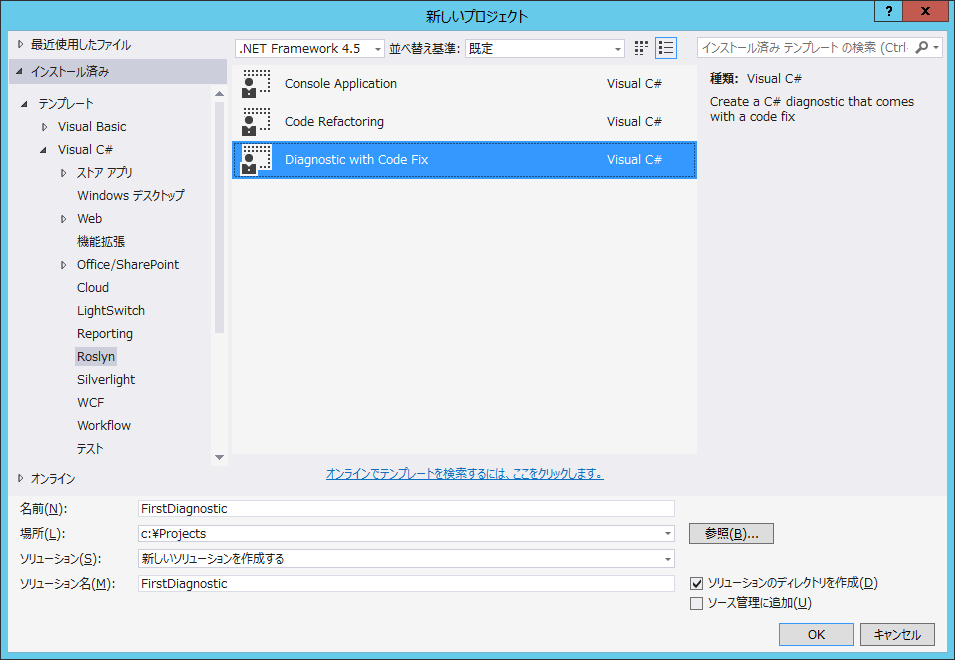

# How To: C#による診断機能およびコード修正機能を実装する方法

原文：[How To: Write a C# Diagnostic and Code Fix](http://www.codeplex.com/Download?ProjectName=roslyn&DownloadId=822458)

2014年4月

## はじめに

これまでにリリースされているVisual Studioでは C# や Visual Basic を
対象とする警告機能を独自に実装することは簡単ではありません。
しかし .NET Compiler Platform ("Roslyn") の診断用APIを使用すれば
この難しい機能が簡単に実現できます！
必要になるのは問題を特定するための分析処理を行うことだけです。
また、場合によってはツリーの変形を行うことでコードを修正することも可能です。
バックグラウンドスレッドで分析処理を実行開始したり、
エディタ上で波状の下線を表示したり、
Visual Studioのエラーリストに項目を追加したり、
修正案の通知のために「電球マーク」を用意したり、
リッチなプレビューを表示したりといった複雑な処理はいずれも自動的に行われます。

このウォークスルーではRoslynのAPIを使用して診断機能(Diagnostic)を作成し、
さらにコード修正機能(Code Fix)も追加します。
診断機能とはソースコードの分析を行い、問題をユーザーに通知する機能のことです。
また診断機能のオプションとして、ユーザーの作成したソースコードに対する
変更を提案するコード修正機能を実装することもできます。
たとえば大文字で始まるローカル変数名をすべて検出するような診断機能を作成し、
さらにそれらの変数名を小文字始まりに修正するような
コード修正機能を実装したりできます。

## 診断機能を実装する

たとえば任意のローカル変数宣言に対して、
それがローカル定数に変換出来る場合には警告表示するような機能を実装したいとします。
つまり以下のようなコードがあるとします：

```csharp
int x = 0;
Console.WriteLine(x);
```

このコードにある `x` には定数値が割り当てられ、変更されていません。
したがってこの宣言には `const` 修飾子を追加できます：

```csharp
const int x = 0;
Console.WriteLine(x);
```

変数が定数に変換可能かどうかを検出する機能は実際にはやや複雑で、
文法的な解析を行い、初期化子の式が定数かどうかを解析し、
変数が決して変更されていないことを確認する必要があります。
しかし .NET Compiler Platform を使用すれば、
この解析機能を実装し、診断機能として公開するのは非常に簡単です。

1. まず C# Diagnostic プロジェクトを新規作成します。
  * Visual Studioで[ファイル]-[新規作成]-[プロジェクト]を選択して
    [新しいプロジェクト]ダイアログを表示します。
  * [Visual C#]-[Roslyn] 以下から [Diagnostic with Code Fix] を選択します。
  * プロジェクトの名前を **`FirstDiagnostic`** として[OK]をクリックします。
    
2. `Ctrl+F5` キーを押して、Roslyn Previewの拡張機能が読み込まれた
   2つめのVisual Studio上でこの新規作成した診断機能プロジェクトを実行します。
  * 起動した2つめのVisual Studioインスタンス上でC# コンソールアプリケーション
    プロジェクトを新規作成します。
    すると波状の下線がトークンにホバー表示され、診断機能で指定された
    警告文が表示されます。
    
    波状の下線が表示されない場合には[ツール]-[拡張機能と更新プログラム]を開いて
    Roslyn Previewが有効になっていることを確認してください。
    Roslyn Previewがリストに表示されていない場合にはSDK Previewの
    .zipファイル内にある `Install Roslyn Preview into Roslyn Experimental Hive.exe`
    を実行する必要があるでしょう。
    
    この診断機能はデバッガープロジェクトの `AnalyzeSymbol` メソッドで
    実装されています。
    したがってC#ファイル内にあって小文字を識別子名に含むような、
    すべての型宣言を検出するコードが初期状態でデバッガープロジェクトには
    用意されているというわけです。
    
  * 初期状態の診断機能が確認出来たので、2つめのVisual Studioインスタンスを終了して
    診断機能プロジェクトに戻ります。
3. 診断分析機能を実装している、プロジェクト内のDiagnosticAnalyzer.csファイルを
   少し確認してみましょう。
   注意すべき点は以下の2点です：
  * 診断分析機能にはいずれも `[ExportDiagnosticAnalyzer]` 属性を
    指定する必要があります。
    この属性には診断機能IDや対象とする言語など、重要な項目を設定します。
    なお現時点ではさらに `[DiagnosticAnalyzer]` 属性も指定する必要があります。
    これは既知の不具合です。
  * 診断分析機能では `IDiagnosticAnalyzer` 派生のインターフェイスを
    1つ以上実装する必要があります。
    今回の場合、テンプレートではデフォルトで `ISymbolAnalyzer` インターフェイスが
    実装されています。
    このインターフェイスでは `AnalyzeSymbol` と呼ばれるメソッドを
    実装する必要があります。
    このメソッドは対象のコードにおいてシンボルの宣言が変更されたり、
    シンボルが追加されたりした場合に毎回呼ばれます。
4. 今回実装する、ローカル変数を定数に変換可能かどうか解析する機能に対しては、
   いくつかの実装方法が考えられます。
   直感的な方法としては `ISyntaxNodeAnalyzer<TSyntaxKind>` インターフェイスを
   実装して、ローカル宣言に対するシンタックスノードを一度に1つずつ
   チェックしていき、初期化子が定数であることを確認することになります。
   そのため、まずは以下の操作を行います：
  * `DiagnosticAnalyzer` 型に実装されている `ISymbolAnalyzer` インターフェイスを
    `ISyntaxNodeAnalyzer<SyntaxKind>` に変更します。
    波線が表示されている `SyntaxKind` 型の位置で `Ctrl+.` キーを押して
    `Microsoft.CodeAnalysis.CSharp` 名前空間のusingを追加します。
    型宣言の上にあるTODOのコメントを削除します。
  * 既に実装されているメンバー `SymbolKindsOfInterest` および `AnalyzeSymbol` を
    削除します。
    これらは使用されません。
  * 
