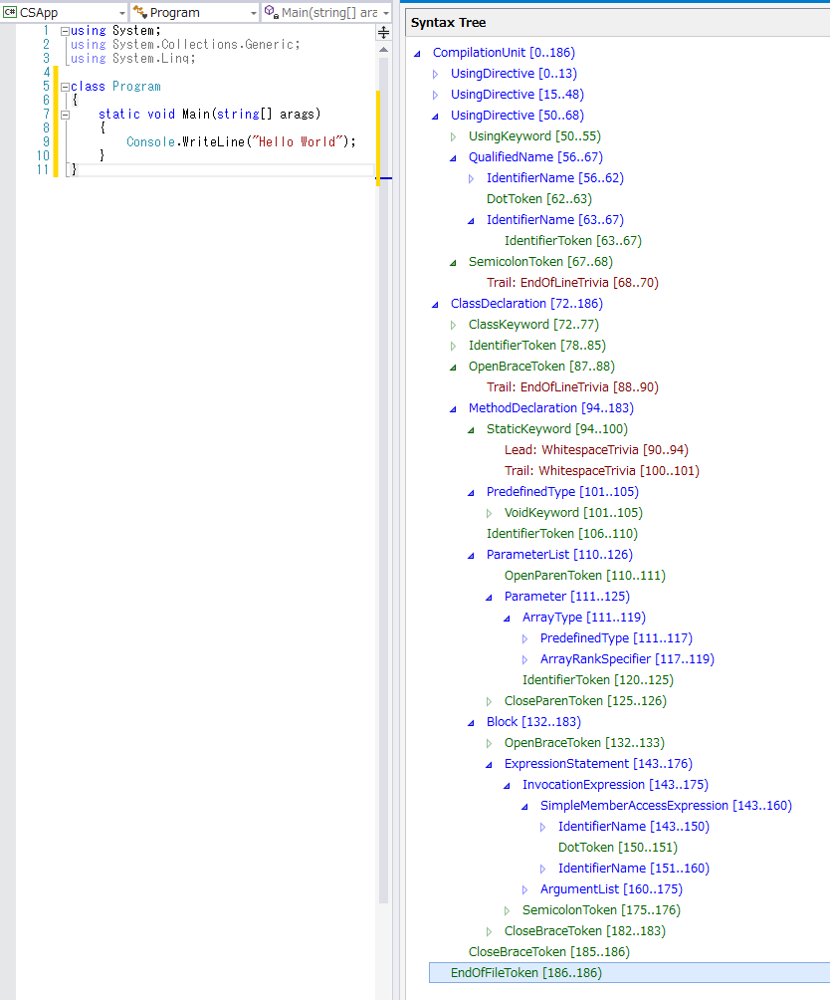

# はじめに：Syntax Analysis

原文：[Getting Started - Syntax Analysis (CSharp) Word docx](http://www.codeplex.com/Download?ProjectName=roslyn&DownloadId=822182)

2014年3月

## 必須項目

* Visual Studio 2013
* "Roslyn" End User Preview
* "Roslyn" SDK プロジェクトテンプレート
* "Roslyn" SDK Syntax Visualizer

## 前書き

現在、Visual Basic や C# コンパイラはブラックボックス、つまり
テキストを入力するとバイト列が出力されるものであり、
コンパイルパイプラインの中間フェーズも全く不透明なものです。
**.NET Compiler Platform** (通称"Roslyn：ロズリン") を使用すると、
コンパイラがコードを理解するために秘密裏に蓄積および補完していた情報とともに、
コンパイラの使用するデータ構造やアルゴリズムと同じものをツールで利用したり、
開発者が使用したりすることができるようになります。

このウォークスルーでは **シンタックスAPI (Syntax API)** について説明します。
シンタックスAPIにはパーサーの機能や、シンタックスツリーそのもの、
そしてシンタックスツリーの構築に関わる原因を追求したり、ツリーを構築したり
するためのユーティリティがそろっています。

## シンタックスツリーを理解する

**シンタックスAPI** にはコンパイラが Visual Basic あるいは C# プログラムを
理解する際に使用するシンタックスツリーの機能があります。
このシンタックスツリーはプロジェクトのビルド時、あるいは
開発者がF5キーを押した際に使用されるパーサーと同じものを使用して生成されます。
シンタックスツリーには特定の言語に対する完全再現性があります。
つまりコードファイル中にある、コメントや空白なども含めて
すべての要素それぞれがツリー内で表現されます。
シンタックスツリーをテキストとして書き出すと、
パースした元々のコードと全く同じものが出力できるというわけです。
また、シンタックスツリーは不変です。
一度作成したシンタックスツリーはその後変更できません。
したがって、ツリーを使用する場合にはロックの必要もなく、
任意の並列度で、データが決して変更されないという保証付きで
複数スレッドからツリーを解析することができます。

シンタックスツリーの主な4つの構成要素は以下の通りです：

* **SyntaxTree** クラス。このインスタンスは完全なパースツリーを表します。
  **SyntaxTree** は抽象クラスで、言語固有の派生クラスがあります。
  特定の言語でシンタックスをパースする場合には
  **CSharpSyntaxTree** (あるいは **VisualBasicSyntaxTree**) クラスのパース用
  メソッドを呼び出すことになります。
* **SyntaxNode** クラス。このインスタンスは宣言やステートメント、句、
  式などを表します。
* **SyntaxToken** クラス。個別のキーワードや識別子、演算子、括弧などを表します。
* そして最後に **SyntaxTrivia** クラス。
  トークン間の空白やプリプロセッサディレクティブ、コメントなど、
  文法的には重要ではない要素を表します。

**SyntaxNode** は階層的に組み合わされてツリー構造をなします。
それによってVisual Basic または C# のコード片にあるすべての要素が
完全に表現されることになります。
たとえば以下の C# コードを "Roslyn" Syntax Visualizerで調査すると
(Visual Studio上で[表示]-[その他のウィンドウ]-[Roslyn Syntax Visualizer]を選択)、
ツリービューには下図のように表示されます：

<div style="color:#6400FD;">SyntaxNode: 青</div>

<div style="color:#006400;">SyntaxToken: 緑</div>

<div style="color:#AA0064;">SyntaxTrivia: 赤</div>

C# コードファイル



このツリー構造を調べると、コードファイル内にあるすべてのステートメントや式、
トークン、空白文字に至るまですべてのものが見つかります！

## ツリーの走査

### 手動による走査

以下の手順では**エディット コンティニュ**を使用して、
C#のソーステキストがパースされる方法、
およびソース内にある引数の宣言を検索する方法について説明します。

#### 例：ツリーの手動による走査

1. C# Roslyn Console Applicationプロジェクトを新規作成します。
  * Visual Studioで[ファイル]-[新規作成]-[プロジェクト]を選択して
    [新しいプロジェクト]ダイアログを表示します。
  * [Visual C#]-[Roslyn] 以下から [Console Application] を選択します。
  * プロジェクトの名前を `**GettingStartedCS**` として[OK]をクリックします。
2. 以下のコードを `Main` メソッド内に入力します：

   ```csharp
   SyntaxTree tree = CSharpSyntaxTree.ParseText(
   @"using System;
   using System.Collections;
   using System.Linq;
   using System.Text;
   
   namespace HelloWorld
   {
       class Program
       {
           static void Main(string[] args)
           {
               Console.WriteLine(""Hello, World!"");
           }
       }
   }");
   
   var root = (CompilationUnitSyntax)tree.GetRoot();
   ```

3. カーソルを `Main` メソッドの**閉じ括弧**がある行に移動させて
   ブレークポイントを設定します。
  * Visual Studio上で[デバッグ]-[ブレークポイントの設定/解除]を選択します。
4. プログラムを実行します。
  * Visual Studio上で[デバッグ]-[デバッグ開始]を選択します。
5. デバッグ実行中に `root` 変数上にマウスを移動して、
   データヒントを展開して調査します。
  * `Usings` プロパティの値が4つの要素を持った
    コレクションであることを確認してください。
    パースしたテキスト中にあるusingディレクティブがそれぞれ対応します。
  * ルートノードの(`base`内にある) `Kind`プロパティが
    `SyntaxKind.CompilationUnit` であることを確認してください。
  * `CompilationUnitSyntax` ノードの `Members` には1つの要素しか
    含まれていないことを確認してください。
6. ルートの`CompilatonUnitSyntax`変数の最初の要素を新しい変数に格納するために
   以下のコードを`Main`メソッドの末尾に追記してください：

   ```csharp
       var firstMember = root.Members[0];
   ```

7. このステートメントが次に実行されるように設定して、
   ステートメントを実行してください。
  * この行で右クリックして[次のステートメントの設定]を選択します。
  * Visual Studioのメニューから[デバッグ]-[ステップ オーバー]を選択して
    このステートメントを実行し、新しい変数を初期化させます。
  * 上記の操作は以下の手順において新しい変数を追加し、その値をデバッガで
    確認する際には繰り返し行うことになることに注意してください。
8. `firstMember` 変数上にマウスを移動させた後、データヒントを展開して値を確認します。
  * `Kind` が `SyntaxKind.NamespaceDeclaration` であることを確認してください。
  * 実行時の型が `NamespaceDeclarationSyntax` であることを確認してください。
9. このノードを `NamespaceDeclarationSyntax` にキャストして、新しい変数に格納します：

   ```csharp
       var helloWorldDeclaration = (NamespaceDeclarationSyntax)firstMember;
   ```

10. このステートメントを実行して `helloWorldDeclaration` 変数を調査します。
  * `CompilationUnitSyntax` と同じく、 `NamespaceDeclarationSyntax` には
    `Members` コレクションがあることを確認してください。
11. `Members` コレクションを確認します。
  * コレクションには1つの要素が含まれていることを確認してください。
    * `Kind` が `SyntaxKind.ClassDeclaration` であることを確認してください。
    * 実行時の型が `ClassDeclarationSyntax` であることを確認してください。
12. このノードを `ClassDeclarationSyntax` にキャストして新しい変数に格納します：

   ```csharp
   var programDeclaration = (ClassDeclarationSyntax)helloWorldDeclaration.Members[0];
   ```

13. このステートメントを実行します。
14. `programDeclaration.Members` コレクション内にある `Main` 宣言を
    新しい変数に格納します：

   ```csharp
       var mainDeclaration = (MethodDeclarationSyntax)programDeclaration.Members[0];
   ```

15. このステートメントを実行して `MethodDeclarationSyntax` オブジェクトの
    メンバーを調査します。
  * `ReturnType` および `Identifier` プロパティを確認してください。
  * `Body` プロパティを確認してください。
  * `ParameterList` を確認して調査してください。
    * 引数リストだけでなく、開閉括弧もメンバーに含まれていることを確認してください。
    * 引数が `SeparatedSyntaxList<ParameterSyntax>` として格納されていることを
      確認してください。
16. `Main` 宣言の1番目の引数を変数に格納します：

   ```csharp
       var argsParameters = mainDeclaration.ParameterList.Parameters[0];
   ```

17. このステートメントを実行して `argsParameter` 変数を調査します。
  * `Identifier` プロパティを確認してください。
    なおこの値の型が `SyntaxToken` 構造体になっていることも確認してください。
  * `SyntaxToken` 型の `Identifier` プロパティを確認してください。
    なお識別子のテキストは `ValueText` プロパティに見つけられます。
18. プログラムを停止します。
  * Visual Studio上で[デバッグ]-[デバッグの停止]を選択します。
19. この時点で以下のようなコードになっているはずです：

   ```csharp
   using System;
   using System.Collections.Generic;
   using System.Linq;
   using System.Text;
   using Microsoft.CodeAnalysis;
   using Microsoft.CodeAnalysis.CSharp;
   using Microsoft.CodeAnalysis.CSharp.Symbols;
   using Microsoft.CodeAnalysis.CSharp.Syntax;
   using Microsoft.CodeAnalysis.Text;
   
   namespace GettingStartedCS
   {
       class Program
       {
           static void Main(string[] args)
           {
               SyntaxTree tree = CSharpSyntaxTree.ParseText(
   @"using System;
   using System.Collections;
   using System.Linq;
   using System.Text;
   
   namespace HelloWorld
   {
       class Program
       {
           static void Main(string[] args)
           {
               Console.WriteLine(""Hello, World!"");
           }
       }
   }");
   
               var root = (CompilationUnitSyntax)tree.GetRoot();
   
               var firstMember = root.Members[0];
   
               var helloWorldDeclaration = (NamespaceDeclarationSyntax)firstMember;
   
               var programDeclaration = (ClassDeclarationSyntax)helloWorldDeclaration.Members[0];
   
               var mainDeclaration = (MethodDeclarationSyntax)programDeclaration.Members[0];
   
               var argsParameters = mainDeclaration.ParameterList.Parameters[0];
           }
       }
   }
   ```

### クエリメソッド

`SyntaxNode` から派生したクラスのプロパティを使用して走査する以外にも、
`SyntaxNode` に定義されたクエリメソッドを使用してシンタックスツリーを走査することもできます。
これらのメソッドはXPathになじみがあればすぐに使いこなすことができるようになるでしょう。
これらのメソッドとLINQを組み合わせることにより、対象をツリー内から手早く見つけ出せるはずです。

#### 例：クエリメソッドを使用する

1. IntelliSenseを使用して、 `root` 変数に対して呼び出すことが出来る
   `SyntaxNode` のメンバーを確認してください。
  * `DescendantNodes` `AncestorsAndSelf` `ChildNodes` といったクエリメソッドがあることを
    確認してください。
2. `Main` メソッドの末尾に以下のステートメントを追加してください。
   1つめのステートメントではLINQ式と `DescendantNodes` メソッドを使用して、
   先ほどの例と同じ引数リストを取得しています：

   ```csharp
   var firstParameters = from methodDeclaration in root.DescendantNodes()
                                       .OfType<MethodDeclarationSyntax>()
                         where methodDeclaration.Identifier.ValueText == "Main"
                         select methodDeclaration.ParameterList.Parameters.First();
   
   var argsParameter2 = firstParameters.Single();
   ```

3. プログラムのデバッグを開始します。
4. イミディエイト ウィンドウを開きます。
  * Visual Studioのメニューから[デバッグ]-[ウィンドウ]-[イミディエイト]を選択します。
5. イミディエイト ウィンドウ内で `argsParameter == argsParameter2` と入力してエンターキーを押し、
   式を評価します。
  * LINQ式を使用した場合でも、マニュアルでツリーを検索した場合と同じ引数が
    見つかることを確認してください。
6. プログラムを停止します。

### SyntaxWalkers

たとえばファイル内にあるすべてのプロパティ宣言を見つけたい場合などのように、
シンタックスツリー内から特定の型を持つノードをすべて見つけ出したいということがよくあるでしょう。
`CSharpSyntaxWalker` クラスを拡張して `VisitPropertyDeclaration` メソッドをオーバーライドすると、
シンタックスツリーがどのような構造になっているのかを事前に把握せずに
それぞれのプロパティ宣言を処理することができます。
`CSharpSyntaxWalker` はシンタックスツリー内のノードとその子要素を
再帰的に処理していく `SyntaxVisitor` の特殊なクラスです。

#### 例：SyntaxWalkerを実装する

この例ではシンタックスツリー全体を走査して、
`System` ではない名前空間をインポートする `using` ディレクティブを
集めるような `CSharpSyntaxWalker` を実装する方法を説明します。

1. C# Roslyn Console Applicationプロジェクトを `UsingCollectorCS` という名前で新規作成します。
2. `Main` メソッド内に以下のコードを入力します：

   ```csharp
               SyntaxTree tree = CSharpSyntaxTree.ParseText(
   @"using System;
   using System.Collections.Generic;
   using System.Linq;
   using System.Text;
   using Microsoft.CodeAnalysis;
   using Microsoft.CodeAnalysis.CSharp;
   
   namespace TopLevel
   {
       using Microsoft;
       using System.ComponentMode;
   
       namespace Child1
       {
           using Microsoft.Win32;
           using System.Runtime.InteropServices;
   
           class Foo { }
       }
   
       namespace Child2
       {
           using System.CodeDom;
           using Microsoft.CSharp;
   
           class Bar { }
       }
   }");
   
               var root = (CompilationUnitSyntax)tree.GetRoot();
   ```

3. このソーステキストには4カ所に渡ってあちこちに `using` ディレクティブが
   あることを確認してください。
   ファイルレベル、トップレベルの名前空間内、そして2つのネストされた名前空間内にあります。
4. プロジェクトにクラスファイルを追加します。
  1. Visual Studio上で[プロジェクト]-[クラスの追加]を選択します。
  2. [新しい項目の追加]ダイアログでファイルの名前として `UsingCollector.cs` と入力します。
5. `Microsoft.CodeAnalysis` 名前空間と `Microsoft.CodeAnalysis.CSharp` 名前空間の
   `using` ディレクティブを追加します。

   ```csharp
   using Microsoft.CodeAnalysis;
   using Microsoft.CodeAnalysis.CSharp;
   using Microsoft.CodeAnalysis.CSharp.Syntax;
   ```

6. 作成した `UsingCollector` クラスを `CSharpSyntaxWalker` クラスから派生させます：

   ```csharp
       class UsingCollector : CSharpSyntaxWalker
   ```

7. `UsingCollector` クラス内で public readonlyフィールドを宣言します。
   この変数には見つけ出した `UsingDirectiveSyntax` を格納することになります：

   ```csharp
           public readonly List<UsingDirectiveSyntax> Usings = new List<UsingDirectiveSyntax>();
   ```

8. `VisitUsingDirective` メソッドをオーバーライドします：

   ```csharp
           public override void VisitUsingDirective(UsingDirectiveSyntax node)
           {
               
           }
   ```

9. IntelliSenseを使用して、このメソッドの `node` 引数経由で呼び出すことができる
   `UsingDirectiveSyntax` クラスのメンバーを確認します。
  * `NameSyntax` 型の `Name` プロパティがあることを確認してください。
    ここにはインポートされた名前空間の名前が格納されます。

10. `VisitUsingDirective` メソッドを以下のように書き換えて、
    `Name` が `System` 名前空間あるいはそれに続く名前空間を参照していない
    場合には `node` を `Usings` に追加するようにします：

    ```csharp
                if (node.Name.ToString() != "System" &&
                    !node.Name.ToString().StartsWith("System."))
                {
                    this.Usings.Add(node);
                }
    ```

11. `UsingCollector.cs` は以下のようになります：
    
    ```csharp
    using System;
    using System.Collections.Generic;
    using System.Linq;
    using System.Text;
    using System.Threading.Tasks;
    using Microsoft.CodeAnalysis;
    using Microsoft.CodeAnalysis.CSharp;
    using Microsoft.CodeAnalysis.CSharp.Syntax;
    
    namespace UsingCollectorCS
    {
        class UsingCollector : CSharpSyntaxWalker
        {
            public readonly List<UsingDirectiveSyntax> Usings = new List<UsingDirectiveSyntax>();
    
            public override void VisitUsingDirective(UsingDirectiveSyntax node)
            {
                if (node.Name.ToString() != "System" &&
                    !node.Name.ToString().StartsWith("System."))
                {
                    this.Usings.Add(node);
                }
            }
        }
    }
    ```

12. `Program.cs` ファイルに戻ります。
13. `Main` メソッドの末尾に以下のコードを追加して `UsingCollector` のインスタンスを作成し、
    このインスタンスを使用してシンタックスツリーを走査し、
    集められた `UsingDirectiveSyntax` ノードを走査して
    それぞれの名前を `Console` に出力させます：

    ```csharp
                var collector = new UsingCollector();
                collector.Visit(root);
    
                foreach (var directive in collector.Usings)
                {
                    Console.WriteLine(directive.Name);
                }
    ```

14. `Program.cs` は以下のようになります：

    ```csharp
    using System;
    using System.Collections.Generic;
    using System.Linq;
    using System.Text;
    using Microsoft.CodeAnalysis;
    using Microsoft.CodeAnalysis.CSharp;
    using Microsoft.CodeAnalysis.CSharp.Symbols;
    using Microsoft.CodeAnalysis.CSharp.Syntax;
    using Microsoft.CodeAnalysis.Text;
    
    namespace UsingCollectorCS
    {
        class Program
        {
            static void Main(string[] args)
            {
                SyntaxTree tree = CSharpSyntaxTree.ParseText(
    @"using System;
    using System.Collections.Generic;
    using System.Linq;
    using System.Text;
    using Microsoft.CodeAnalysis;
    using Microsoft.CodeAnalysis.CSharp;
    
    namespace TopLevel
    {
        using Microsoft;
        using System.ComponentMode;
    
        namespace Child1
        {
            using Microsoft.Win32;
            using System.Runtime.InteropServices;
    
            class Foo { }
        }
    
        namespace Child2
        {
            using System.CodeDom;
            using Microsoft.CSharp;
    
            class Bar { }
        }
    }");
    
                var root = (CompilationUnitSyntax)tree.GetRoot();
    
                var collector = new UsingCollector();
                collector.Visit(root);
    
                foreach (var directive in collector.Usings)
                {
                    Console.WriteLine(directive.Name);
                }
            }
        }
    }
    ```

15. Ctrl+F5 キーを押してデバッグ無しで実行します。
    すると以下のように表示されるでしょう：

    

16. Walkerが4カ所すべてにある非 `System` 名前空間の `using` ディレクティブを
    見つけてきたことが確認できます。
17. おめでとうございます！
    以上で**シンタックスAPI**を使用して、
     C# のソースコードから特定の種類のC# ステートメントやディレクティブを
    見つけ出すことができました。
